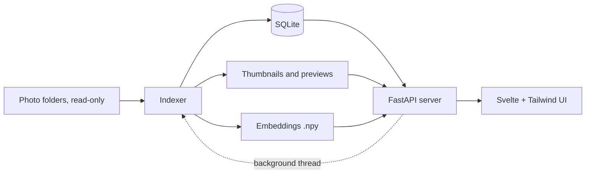

# Riffle — Development Plan

*Formerly "Computational Photo Archive"; renamed to Riffle on 26 September 2026.*

**Status:** MVP implemented (milestones 1–4) plus culling and export (milestone 6) and location from phone history (milestone 7); evaluation (milestone 5) pending
**Date:** 25 September 2026 (updated after implementation, 26 September 2026)
**Scope:** A local tool for finding the best photos among several thousand (from China, and other trips) and exporting them for editing, sharing, or printing. It uses CLIP embeddings for text and image similarity search, zero-shot subject, scene, and look tags for grouping, and pick/reject culling with stacks of similar shots.

## 1. Goal

Make the archive searchable and browsable by what is *in* the pictures, with no training, no labelled data, and no manual annotation required to get value.

The MVP answers one question: **does CLIP-based search and tagging make this archive meaningfully easier to explore?** Everything else waits until that is answered.

The tool's actual use case is **making a selection**: going through a library, marking the photos worth keeping and the ones to reject, and exporting the picks (for editing, sharing, printing). Search, tags, filters, and the timeline serve that; §11.3 describes the culling workflow built on them.

## 2. Principles

1. **Originals are read-only.** The tool never renames, moves, edits, or writes next to source files.
2. **Everything derived is disposable.** Thumbnails, embeddings, and tags can be deleted and regenerated from the originals and the config at any time. The one exception is user-created data, the pick/reject flags, which is kept apart in `selections.sqlite3` (§8.1) so `data/` stays safe to delete.
3. **Local only.** No network calls except downloading model weights once.
4. **No training, no data gathering.** All intelligence comes from a pretrained CLIP model and a hand-written vocabulary file.
5. **Small moving parts.** Prefer the standard library and a few well-known packages over frameworks.

## 3. MVP scope

### In scope

- Scan configured folders for JPEG, PNG, TIFF, and (optionally) HEIC images.
- Track RAW files by filename match only; never read them.
- Extract basic EXIF: capture time, camera, lens, dimensions, orientation, GPS, and exposure (focal length, aperture, shutter speed, ISO).
- EXIF filters: date range, camera, lens, focal length, aperture, ISO, orientation, GPS (added during implementation; "date and camera filters" moved forward from §14).
- Generate orientation-correct thumbnails and previews.
- Compute one CLIP embedding per image.
- Text search ("red lanterns at night", "empty stairwell").
- Similar-image search from any photo.
- Zero-shot **subject**, **scene**, and **look** tags from a vocabulary file, with alternative phrases per tag.
- Exact and near-duplicate grouping via perceptual hash.
- A simple local web UI: grid, tag filter sidebar, search bar, detail view.
- Managing photo folders and running indexing from the UI (added during implementation).
- Date group views (day, month, year) in the grid, with a jump from a photo to its group (added during implementation).
- **Location from phone location history** (§9.8, §14.1; added after the MVP): photos without GPS are placed from a referenced Google Timeline / Records.json / GPX export by capture time, named offline, grouped by place / region / country, filterable, and optionally written into exported copies (§11.3).
- **Culling and export** (§11.3; added after the MVP as the tool's main use case): one global pick/reject flag per photo, grid multi-select with batch flagging, a loupe with auto-advance, undo, stacks of bursts and near-identical shots with a side-by-side compare view and a sharpness hint, and export of the picks (images, images + RAWs, or RAWs only) by copying.

### Explicitly out of scope for the MVP

- RAW decoding, previews, or metadata
- captions, OCR, object detection
- clustering, UMAP maps, outlier detection
- aesthetic scores (the sharpness hint in §9.7 is the only quality measure)
- preference learning or any model training (now a planned candidate: §14.2)
- manual tagging, named collections, star ratings
- maps or reverse geocoding
- multi-user or remote access

These are listed in §14 as candidates for later phases.

## 4. Architecture



- **Indexer:** scans, extracts metadata, makes thumbnails, embeds, tags, groups duplicates. Incremental and restartable. Runs from the CLI (`riffle index`) or in a background thread of the server when started from the UI; both use the same pipeline (`index.run_index`), which reports progress through callbacks.
- **Server (FastAPI):** loads the embedding matrix and CLIP text encoder into memory at startup, serves a JSON API, thumbnails, and the built UI as static files. It reloads the embedding matrix when the files change, so re-indexing does not need a restart.
- **UI (Svelte + Tailwind, built with Vite, no SvelteKit):** a single-page app that talks to the API. `npm run build` writes it into the Python package (`src/riffle/web/`, package data), so every install carries it and the FastAPI server serves it on the same port.
- **Launcher:** `riffle` without arguments starts the server on 127.0.0.1 (port 8000, or a free one), waits until `/api/health` answers, and opens the browser. A `server.json` in the data folder records the running instance; a second launch that finds it answering as Riffle for the same config only opens a browser tab. Launched this way, Riffle also stops by itself once no tab is open: every tab keeps a Server-Sent Events stream (`/api/events`), and a watchdog stops the server 30 s after the last one closed (5 min if none ever connected), never while an index or export runs. `beforeunload` events cannot tell a close from a reload and miss crashes; timer heartbeats get throttled in background tabs; an open connection has neither problem. The stream writes a small keep-alive every 2 s, because with ASGI 2.4 Starlette only notices a gone client when a write fails. The page shows a banner if the server is gone and reconnects on its own. `riffle serve` never stops by itself.

There is no vector database. The whole embedding matrix is held in memory; a search is a single matrix–vector product.

## 5. Technology

| Area | Choice | Notes |
|---|---|---|
| Language | Python 3.12+ | |
| Packaging | `pyproject.toml` + pip | Installed editable into a local `venv/` |
| Images | Pillow (+ `pillow-heif` if HEIC present) | EXIF, transpose, ICC → sRGB, thumbnails |
| Perceptual hash | `imagehash` (pHash) | Duplicate grouping |
| Embeddings | `open_clip_torch` | Model configurable |
| Maths | NumPy | In-memory similarity |
| Database | `sqlite3` (stdlib) | Plain SQL, schema version via `PRAGMA user_version` |
| Server | FastAPI + Uvicorn | |
| Frontend | Svelte 5 + Tailwind CSS 4, built with Vite | No SvelteKit, no router library |
| Tests | pytest | Indexer and API only; synthetic images and a fake encoder |

No SQLAlchemy, Alembic, FAISS, FiftyOne, OpenCV, pyvips, or ExifTool in the MVP.

## 6. Project layout

Per-user files follow the platform conventions (`paths.py`, via `platformdirs`; Linux shown, XDG variables honoured; `riffle paths` prints them). Until 26 Sep 2026 they all lived in the repository root.

```text
~/.config/riffle/         # settings, created on first run from src/riffle/defaults/
  config.yaml                    # source folders, model, thresholds
  vocabulary.yaml                # tag families, tags, and alternative phrases
~/.local/share/riffle/
  selections.sqlite3             # pick/reject flags: user data, NOT derived (§8.1)
~/.cache/riffle/          # all derived data, safe to delete (config: data_dir)
  catalogue.sqlite3
  thumbs/                        # 320 px long edge
  previews/                      # 1600 px long edge
  embeddings/
    <model_id>.npy               # float32, L2-normalised, shape (N, D)
    <model_id>.ids.npy           # photo ids, row-aligned
```

The config is found as: `--config`, else `$RIFFLE_CONFIG`, else `./config.yaml` in the working directory (a self-contained setup), else the user config above. `data_dir`, `selections`, and `vocabulary` in it override the defaults.

```text
project/
  pyproject.toml
  src/riffle/
    paths.py             # per-user locations; finding / creating the config
    defaults/            # config.yaml template, default vocabulary.yaml
    cli.py               # riffle index | tag | serve
    config.py            # config loading; rewriting the sources list
    db.py                # schema and connections
    scan.py              # walk, sha256, EXIF, identity rules
    images.py            # shared loading: HEIC, orientation, sRGB
    raws.py
    thumbs.py
    embed.py
    tags.py
    dupes.py
    index.py             # the index and tag pipelines
    jobs.py              # background jobs (indexing, export) for the server
    filters.py           # shared photo filters and facets
    quality.py           # sharpness
    stacks.py            # bursts / near-identical shots
    selections.py        # pick/reject flags (selections.sqlite3)
    export.py            # copying picks
    timeline.py          # parsing location history exports
    locate.py            # placing photos; offline place names
    geotag.py            # adding GPS to exported copies
    server.py
  web/                   # Vite + Svelte + Tailwind
    src/
      App.svelte
      lib/               # api.js, view state mirrored to the URL
      lib/culling.svelte.js  # flag changes, undo, selection
      components/        # TopBar, Sidebar, Filters, Grid, Detail (loupe), Compare,
                         # SelectionBar, ExportDialog, FolderBrowser, Library, UnmatchedRaws
    index.html
  tests/
```

## 7. Configuration

```yaml
# config.yaml
sources:
  - /Volumes/Photos/China
exclude:
  - "**/.Trashes/**"
image_extensions: [.jpg, .jpeg, .png, .tif, .tiff, .heic]
raw_extensions: [.cr2, .cr3, .nef, .arw, .raf, .dng, .orf, .rw2]
raw_search_dirs: [".", "RAW", "../RAW"]   # relative to each image's folder

data_dir: data
vocabulary: vocabulary.yaml

model:
  name: ViT-L-14-quickgelu   # default since 26 Sep 2026 (was ViT-B-16 / laion2b_s34b_b88k)
  pretrained: dfn2b
  device: auto        # cuda, mps, or cpu
  batch_size: 32

tags:
  softmax_scale: 100
  subject: { min_prob: 0.15, max_tags: 3 }
  scene:   { min_prob: 0.30, max_tags: 1 }
  look:    { min_prob: 0.30, max_tags: 2 }

dupes:
  phash_max_distance: 8

stacks:
  max_gap_seconds: 30     # consecutive photos at most this far apart...
  min_similarity: 0.92    # ...and at least this CLIP-similar form a stack (model-dependent)

selections: selections.sqlite3   # pick/reject flags (user data)

location:
  max_gap_minutes: 30     # outside visits and routes: use a position at most this far in time
  min_population: 0       # place names: nearest town/village with at least this many inhabitants
location_history:         # phone exports, referenced in place (written by the UI)
  - ~/Documents/Timeline.json
```

Relative paths are resolved against the config file's folder. A tag family without thresholds uses `min_prob: 0.2, max_tags: 1`.

The model is a config value. Changing it creates a new embedding file rather than overwriting the old one, so models can be compared side by side. The model id is `<name>__<pretrained>`.

Folders added or removed in the UI are written back to `sources`. Only that block of the file is rewritten; comments and the rest of the file are kept.

## 8. Data model

All tables are rebuildable from originals plus config.

```sql
CREATE TABLE photos (
  id          INTEGER PRIMARY KEY,
  rel_path    TEXT NOT NULL,          -- relative to its source root
  source      TEXT NOT NULL,          -- which configured source
  sha256      TEXT NOT NULL,
  size_bytes  INTEGER, mtime REAL,
  width INTEGER, height INTEGER,      -- as displayed (after EXIF orientation)
  taken_at    TEXT,                   -- EXIF DateTimeOriginal, as written
  tz_offset   TEXT,                   -- EXIF OffsetTimeOriginal, if present
  camera TEXT, lens TEXT,
  lat REAL, lon REAL,
  focal_length REAL, focal_length_35 REAL,   -- mm; 35 mm equivalent if recorded
  aperture REAL, exposure_time REAL,         -- f-number; seconds
  iso INTEGER,
  meta_version INTEGER NOT NULL DEFAULT 0,   -- EXIF extraction version (see §9.1)
  phash       TEXT,
  dupe_group  INTEGER,                -- lowest photo id in the group; NULL if unique
  stack_id    INTEGER,                -- lowest photo id of its stack (§9.7); NULL if alone
  sharpness   REAL,                   -- §9.7
  status      TEXT NOT NULL DEFAULT 'ok',  -- ok | error | missing
  error       TEXT,
  UNIQUE (source, rel_path)
);

CREATE TABLE raws (
  id        INTEGER PRIMARY KEY,
  photo_id  INTEGER REFERENCES photos(id),  -- NULL = unmatched RAW
  rel_path  TEXT NOT NULL,
  source    TEXT NOT NULL,
  size_bytes INTEGER,
  UNIQUE (source, rel_path)
);

CREATE TABLE tags (
  id     INTEGER PRIMARY KEY,
  family TEXT NOT NULL,     -- subject | scene | look (any family in vocabulary.yaml)
  name   TEXT NOT NULL,
  UNIQUE (family, name)
);

CREATE TABLE photo_tags (
  photo_id INTEGER REFERENCES photos(id),
  tag_id   INTEGER REFERENCES tags(id),
  prob     REAL NOT NULL,   -- softmax probability within family
  sim      REAL NOT NULL,   -- cosine similarity of the best-matching phrase
  model_id TEXT NOT NULL,
  PRIMARY KEY (photo_id, tag_id, model_id)
);

-- Which photo content (by sha256) is in each model's embedding file.
CREATE TABLE embedded (
  photo_id INTEGER REFERENCES photos(id),
  model_id TEXT NOT NULL,
  sha256   TEXT NOT NULL,
  PRIMARY KEY (photo_id, model_id)
);
```

### Photo identity

Photos are keyed by `(source, rel_path)`. On rescan:

- same path, same size and mtime → skip;
- same path, changed file → recompute derived data (thumbnails, phash, embedding, and tags are invalidated if the content hash changed);
- path gone but its `sha256` appears at a new path → treat as a move and keep the id;
- otherwise → mark `missing`.

Because the MVP has no human-entered data, identity mistakes cost only recomputation. The scheme is still stable enough to build on later.

Removing a folder from the sources marks its photos `missing` on the next index. Adding a parent of existing sources replaces them, and their photos keep their ids through move detection.

Schema changes are numbered migrations in `db.py`: v2 added the exposure columns, v3 `stack_id` and `sharpness`, v4 the location tables, v5 `clip_highlights` and `clip_shadows`:

```sql
CREATE TABLE photo_locations (         -- derived; rebuilt by the locate step (§9.8)
  photo_id INTEGER PRIMARY KEY REFERENCES photos(id) ON DELETE CASCADE,
  lat REAL NOT NULL, lon REAL NOT NULL,
  source TEXT NOT NULL,                -- exif | visit | route | nearby
  accuracy_m REAL, gap_s REAL,
  country_code TEXT, country TEXT, region TEXT, place TEXT
);
CREATE TABLE meta (key TEXT PRIMARY KEY, value TEXT);   -- step signatures
```

Camera GPS stays in `photos.lat/lon`; `photo_locations` holds the evidence-tagged result for every placed photo, so camera and estimated positions stay distinguishable.

### 8.1 Selections (user data)

Pick/reject flags are the only data the user creates by hand, so they live in their own database, `selections.sqlite3` (in the user data folder, e.g. `~/.local/share/riffle`; configurable), not with the derived data:

```sql
CREATE TABLE flags (
  sha256     TEXT PRIMARY KEY,   -- file content, not path or photo id
  flag       TEXT NOT NULL CHECK (flag IN ('pick', 'reject')),
  source     TEXT, rel_path TEXT, -- last known location, for humans and recovery
  updated_at REAL NOT NULL
);
```

- Keyed by content hash, so flags survive deleting `data/`, re-indexing, and moving or renaming files. Exact copies share a flag. Editing a file (new content) drops its flag.
- Unflagged photos have no row.
- Catalogue connections `ATTACH` it as `sel` (read-only in the server), so filters, counts, and listings join flags in plain SQL (`selections.flag_expr`).
- **Export history** (selections schema v2): an `exported` table (sha256, first/last time, count, last folder), filled when an export has put a photo's files in place (copied, or already there). It is independent of the flag, so a photo can be picked (or rejected) and exported at once. Surfaced as a ↗ badge, the `exported=true|false` filter, the photo view, and the export option "only photos not exported before"; `POST /api/exported/reset` forgets it.
- Not written as XMP sidecars, which would put files next to the originals (principle 1). Exporting flags to XMP for Lightroom or darktable is a candidate (§14).

## 9. Pipeline

One command runs all steps incrementally: `riffle index` (or **Index now** in the UI). Each step only processes photos that need it; the CLIP model is only loaded when something needs embedding or tagging.

### 9.1 Scan

1. Walk sources, skipping excludes, hidden `._*` files, and the archive's own `data_dir`.
2. For each image, record path, size, mtime, and sha256.
3. Read EXIF with Pillow: `DateTimeOriginal`, `OffsetTimeOriginal`, make/model, lens, GPS, orientation, focal length (and 35 mm equivalent), f-number, exposure time, ISO.
4. Record unreadable files as `status = error` with the message and continue.
5. When EXIF extraction gains fields (`META_VERSION` in `scan.py`), unchanged files are re-read header-only on the next scan; no derived data is recomputed.

Schema changes are applied as numbered migrations in `db.py` (v2 added the exposure columns).

Capture times are stored as written by the camera. No timezone correction in the MVP.

### 9.2 RAW matching

For each RAW file found in the sources:

1. Take its stem, case-insensitive (`IMG_1234.CR3` → `img_1234`).
2. Look for an image with the same stem in the same folder, then in each configured search dir.
3. If found, link it; otherwise store it with `photo_id = NULL`.

RAW files are never opened; only their name and size are read. The UI shows a RAW badge and the RAW path for matched photos. An "Unmatched RAWs" count links to a plain list.

Only RAWs inside the configured sources are found; a `../RAW` folder outside every source is not scanned.

### 9.3 Thumbnails and previews

Apply `ImageOps.exif_transpose`, convert to 8-bit sRGB (using the embedded ICC profile when present), and save a 320 px thumbnail and a 1600 px preview as JPEG, named by photo id. Images are never upscaled. Work runs in a process pool.

### 9.4 Embeddings

1. Load the configured OpenCLIP model.
2. Embed the previews in batches (not the full originals).
3. L2-normalise and write `<model_id>.npy` plus the aligned id array.
4. On incremental runs, embed only new or changed photos (tracked in the `embedded` table), drop removed ones, and rewrite both files. At this archive size, a full rewrite takes well under a second.

### 9.5 Tags

Tags are zero-shot and require no training or labelled data.

1. Load `vocabulary.yaml` (§10). Each tag has a name and optional alternative phrases.
2. For each phrase, encode every prompt template and average them into one normalised text vector.
3. For each family, compute photo–phrase similarities for all photos at once, and score each tag by its **best-matching phrase** (max similarity).
4. Apply a softmax over the family's **tags** with `softmax_scale`, so a tag's own phrases never compete with each other.
5. Keep tags with `prob ≥ min_prob`, up to `max_tags`, highest first.
6. Replace that model's rows in `photo_tags`, and remove tags that are no longer in the vocabulary.

Thresholds are tuned by eye in the UI and edited in `config.yaml`. Rerunning `riffle tag` takes seconds, because it reuses stored embeddings.

**Known limitations:**

- The softmax is relative, so every photo gets at least its best tag in each family even when nothing fits well. Catch-all labels (`other` for scene, `ordinary daylight` for look) absorb some of this.
- Tags within a family that overlap (e.g. "cats" and "animals") split probability between them. The vocabulary uses non-overlapping main tags with specific phrases underneath instead.
- Visible signage can pull tags toward what the text says.
- Abstract concepts ("waiting", "tension") do not work well as text labels, so the vocabulary sticks to concrete, visible things.
- Observed on a first real library: birds against the sky are sometimes also tagged as aircraft.

### 9.6 Duplicates

1. Compute pHash on each preview.
2. Compare all pairs by Hamming distance. At a few thousand images, a NumPy brute-force comparison (in chunks) is fine.
3. Link pairs within `phash_max_distance` into groups (union–find), stored in `dupe_group`.

The grid shows one representative per group with a count badge. Burst shots with reframing are not caught by pHash; stacks (§9.7) catch them.

### 9.8 Locations

Runs every index after stacks, skipped when nothing it depends on changed (a signature over the history files' path/size/mtime, the location settings, and every photo's time, offset, and GPS); a full run over the first library takes about a second.

1. **Parse** (`timeline.py`) the referenced files into visits (start, end, position), routes (activity start/end positions), points (time, position, accuracy), and time-zone spans. Formats: the phone Timeline export (Android `semanticSegments` + `rawSignals` with `"52.5°, 13.4°"` strings; the iOS list variant with `geo:` strings), Takeout `Records.json`, and GPX. Parsed files are cached by path, size, and mtime; the first user's 43 MB export (2013–2026, 6,262 visits, 6,632 routes, 109,266 points) parses in 0.5 s.
2. **Place** (`locate.py`) each `ok` photo: camera GPS first (`exif`). Otherwise the capture time is made absolute with the EXIF offset, or with the timeline's own offset for that local time, then: inside a visit → the most specific (shortest) visit (`visit`, ~50 m); inside an activity → linear interpolation between the nearest points around it within the activity, or its start/end (`route`, accuracy half the bracket distance, capped at 5 km); otherwise between points both within `max_gap_minutes` (`route`), or one point within half of it (`nearby`); else unplaced.
3. **Name** all positions in one batch with `reverse_geocode` (bundled GeoNames cities1000 with states; KD-tree; offline): nearest town or village, region (state/province), country. Group keys: `cc`, `cc|region`, `cc|region|place`.

On the first real library: every photo has an EXIF time-zone offset; 587 of 743 photos were placed from visits and 156 along routes (mean accuracy ~230 m, at most 9 minutes from the nearest evidence). They were all taken within 1.8 km of one point, so they form a single place: town-level names are the right level for trips, not for one area (see §14.1 for finer spots).

### 9.7 Stacks and sharpness

Culling aids, both derived and recomputed on every index in about a second (no model needed).

**Sharpness** (`quality.py`), computed with the pHash on each preview: the Laplacian (fine detail) of an 800 px greyscale copy (downsampling first keeps sensor noise from looking like detail), its variance per 50 px tile, and the mean of the sharpest 5% of tiles. Scoring the in-focus region rather than the whole frame keeps a sharp subject against a blurred background from scoring low; on the first real library the whole-frame variance ranked close-ups with shallow depth of field far too low. The value is only shown relative to the other photos in a stack or compare set, since scene content changes it a lot.

**Exposure clipping** (`quality.clipping`), in the same pass: the share of the preview that is near-white (all three channels ≥ 250: blown highlights) and near-black (all ≤ 5: crushed shadows). Requiring all channels matters: counting any channel at 255 flagged saturated yellow flowers as a third "blown" on the first real library, while the all-channel rule scores them 0% and still catches a blown window (16%) and a white sky (17%). Clipping over 2% blown (8% of that library) or 5% crushed (3%; black backgrounds are often intentional) is flagged in the photo and compare views. It was briefly a sidebar filter too, but was removed from the UI as an odd thing to filter by; the API still accepts `exposure=`.

**Suggested keeper** (`quality.keeper_scores`, `GET /api/suggest?ids=`): among photos being compared, sharpness relative to the sharpest (weight 0.5), a CLIP quality score relative to the others (0.3; the CLIP-IQA prompt pairs "Good photo."/"Bad photo." and "Sharp photo."/"Blurry photo." against the stored embeddings, computed on request), and exposure (0.2; 10% blown or 25% crushed scores 0). On a 17-shot flower stack the top two were the ones in focus and the bottom three the soft ones, with the CLIP score agreeing independently. It is a hint in the compare view (★, key A), never applied automatically.

**Stacks** (`stacks.py`): photos in capture order are linked to the next one when taken at most `max_gap_seconds` apart with CLIP cosine similarity ≥ `min_similarity`; these links are merged with the duplicate groups (union–find), and every connected set of two or more is a stack. On the first real library (743 photos, very bursty wildlife shooting: 253 consecutive pairs within 2 s), the defaults 30 s / 0.90 give 141 stacks covering 510 photos, the largest 29. Requiring similarity to the stack's first photo as well (against slow drift) made no difference there, so the chaining stays simple.

Similarity values depend on the model. After the switch to ViT-L-14 (DFN-2B), which rates consecutive shots as more similar (median 0.955 vs 0.937 within 30 s), 0.92 matched the B-16 links at 0.90 best (91% agreement on 810 consecutive pairs; 557 vs 545 links; 251 stacks covering 813 of 1,146 photos vs 253 / 804). The pairs the two models disagree on were borderline reframings of the same subject either way.

## 10. Vocabulary

Families are top-level keys (any number; the MVP uses `subject`, `scene`, and `look`). An entry is either a plain tag name or a tag with alternative phrases; the tag name itself is always one of its phrases.

```yaml
# vocabulary.yaml (excerpt; the full file has ~110 tags)
templates:
  - "a photo of {}"
  - "a photograph of {}"
  - "a street photo of {}"

subject:
  - people: [a person, a man, a woman, people walking, pedestrians, a couple]
  - street vendors: [a street vendor, a food stall, a hawker selling goods, a fruit seller]
  - cats: [a cat, a kitten, a cat sleeping]
  - livestock: [sheep, cows, horses, goats, pigs, a herd of animals, a water buffalo]
  - a temple or pagoda: [a temple, a pagoda, a buddha statue, incense burning, a shrine]
  - lanterns: [red lanterns, paper lanterns, hanging lanterns]
  - mountains: [mountains, hills, a mountain peak, a cliff, rocks]

scene:
  - a quiet alley: [a quiet alley, a narrow lane, a hutong, an empty backstreet]
  - a market: [a market, a street market, a wet market, a night market, a bazaar]
  - farmland: [farmland, rice paddies, crop fields, a farm, a vegetable plot]
  - other: [an abstract image, a blurry photo, a close-up texture, a plain background]

look:
  - black and white: [a black and white photo, a monochrome photograph]
  - night: [a photo taken at night, night lights, street lights at night]
  - fog or mist: [fog, mist, haze, a misty morning]
  - ordinary daylight: [an ordinary daytime photo, a photo in plain daylight]
```

Editing this file and rerunning `riffle tag` is the whole workflow for changing tags.

## 11. Server and UI

### 11.1 API

| Method | Path | Purpose |
|---|---|---|
| GET | `/api/photos?<filters>&collapse=dupes&sort=taken_at&group=&offset=&limit=` | Paged grid listing. `collapse`: `dupes` (one tile per duplicate group), `stacks` (one per stack: its pick if any, else the first), `none`; `dupes=collapse|all` is accepted as the older spelling. Items carry `flag`, `stack_id`, `stack_count`, `sharpness`. `sort`: `taken_at`, `-taken_at`, `path`, `id`. With `group=day|month|year|place|region|country`, items come grouped (date groups in date order; location groups in trip order, by each group's first photo, each with a `label` and `first`/`last` capture dates) with a `group` key (`""` = undated, last) and `groups` lists every non-empty group of the filtered set with its count |
| GET | `/api/photos/{id}` | Detail: metadata, tags with probabilities, RAW paths, duplicate group, flag, stack members |
| GET | `/api/search/text?q=&<filters>&dupes=&offset=&limit=` | Text search within the filters |
| GET | `/api/search/similar/{id}?<filters>&dupes=&offset=&limit=` | Similar images (the query photo and, when collapsing, its duplicates are excluded) |
| GET | `/api/tags?<filters>` | Tags grouped by family, with counts **within the filters**; tags no matching photo carries are omitted (selected tags are always included). Also total photos, unmatched RAW count, model id |
| GET | `/api/facets?<filters>` | EXIF filter options: date range, cameras and lenses with counts, focal/aperture/ISO ranges, orientation and GPS counts. Each facet ignores its own filter so its options stay selectable |
| POST | `/api/flags` `{ops: [{ids, flag}]}` | Set `pick` / `reject` / `null`, atomically and in order; returns every affected photo's previous flag (for undo) |
| POST | `/api/flags/reset?<filters>` `{scope}` | Unflag everything (`all`, including flags of files no longer in the library) or the photos within the filters (`filtered`); returns the previous flags (undo) |
| GET | `/api/ids?<filters>&collapse=` | Every id of the listing, in order (select all) |
| GET | `/api/stacks?<filters>&unreviewed=` | Stacks with a photo matching the filters (and, with `unreviewed`, an unflagged photo), in date order |
| GET | `/api/stacks/{id}` | All photos of a stack, in capture order |
| GET | `/api/groups?group=&<filters>` | Only the groups of a grouped listing, each with count, first/last capture, and a cover photo (a pick if any, else the first); location groups add a label and a centre (mean position). Used by the calendar and map overviews |
| GET | `/api/suggest?ids=` | Suggested keeper among photos, with the sharpness / exposure / quality scores behind it |
| POST | `/api/exported/reset?<filters>` `{scope}` | Forget the export history (all, or within the filters) |
| POST / GET | `/api/export?<filters>` `{folder, name, content, raw_fallback, structure, scope, add_location, only_new}` | Start / status of an export of the picks (`scope`: `all`, or `filtered` by the query-string filters); runs in the background |
| GET | `/api/location-history` | Referenced history files (format, date span, counts, errors) and photos placed per source |
| POST / DELETE | `/api/location-history` `{path}` | Add (validated by parsing) or remove a history file in `config.yaml`, then start indexing |
| GET | `/api/raws/unmatched` | Unmatched RAW list |
| GET | `/api/sources` | Configured folders with photo counts |
| POST / DELETE | `/api/sources` `{path}` | Add or remove a folder (written to `config.yaml`), then start indexing |
| GET | `/api/fs?path=&files=` | Server-side folder browser: subfolders and image count (defaults to the home folder); `files=history` also lists `.json`/`.gpx` files |
| GET / POST | `/api/index` | Indexing status (step, progress, log, error) / start a background run; a request during a run queues one more run |
| GET | `/thumbs/{id}.jpg`, `/previews/{id}.jpg` | Static images |
| GET | `/` | Built Svelte app |

`<filters>` are shared by all these endpoints (`filters.py`): `tags=1,2` (AND), `date_from`/`date_to` (`YYYY-MM-DD`), repeated `camera=`/`lens=` (OR; empty value = unknown), `focal_min/max`, `aperture_min/max`, `iso_min/max`, repeated `orientation=` (`landscape`, `portrait`, `square`), `gps=true|false`, repeated `flag=` (`pick`, `reject`, `none`), repeated `exposure=` (`highlights`, `shadows`, `ok`), repeated `country=` / `region=` / `place=` (location keys) and `loc_source=` (`exif`, `visit`, `route`, `nearby`, `none`). Different filters combine with AND. `/api/tags` also returns the total numbers of picks and rejects.

At startup the server loads the embedding matrix and the CLIP text encoder only; the image encoder is not needed at serve time (background indexing loads its own model). Tag filters on search are applied as a boolean mask over the matrix before ranking.

Mutating endpoints accept only JSON bodies, so other websites cannot trigger them from the browser without a CORS preflight (which the server does not grant). The folder browser can list any directory the server can read, so the server binds to `127.0.0.1` by default.

### 11.2 UI

A single page with no router; view state lives in a small Svelte store and is mirrored into the URL query string (`q`, `similar`, `tags`, the EXIF and flag filters, `group`, `collapse`, `photo`) so views can be bookmarked.

- **Top bar:** search input (Enter runs text search), "similar to" chip, grouping (a select: None / Day / Month / Year / Place / Region / Country; browsing only, not search results), **Stacks** and **Hide rejected** toggles, result count, **Review stacks**, **Export (n picks)**, **Library** button (shows indexing progress), clear button.
- **Left sidebar, filters:** flag (picked / rejected / unflagged), location (source, country, place), date range, camera, lens, focal length, aperture, ISO, orientation, GPS, with counts within the other active filters. A filter that cannot narrow the results (e.g. a single camera) is hidden unless in use. The camera name is EXIF Make + Model, with the make dropped when the model repeats it. **Reset** clears them.
- **Left sidebar, tags:** one section per tag family, in vocabulary order, with counts within the current filter. Tags with no matching photos are hidden. Click a tag to filter, click again to remove. Filters combine with search.
- **Overviews** (the **Calendar**/**Map** button next to Group, or `O`; mirrored in the URL): with a date grouping, a calendar of the year (month grids; days with photos show a cover and a count; year switcher); with a location grouping, a map with one cluster per place, region, or country (size by count, hover card with cover and dates). Clicking a day, month, year, or cluster opens that group in the grid (the existing jump). The map draws Natural Earth country outlines bundled via `world-atlas` (50m resolution, loaded lazily as a separate chunk) with d3-geo and d3-zoom: offline by design (principle 3; online tiles would also reveal the viewed areas to a tile server). Street-level detail was deliberately left out.
- **Grid:** responsive thumbnail grid with infinite scroll and multi-select (§11.3). Picks have a green ✓, rejects are dimmed with a red ✕, stacks have a ▦ count badge that opens the compare view. When grouped: sticky section headers with the group's full count, only groups with matching photos, a **Jump to…** menu, and **Only this day/month/year** to turn a group into a date filter. Badges show RAW and duplicate count; search results show their score on hover.
- **Detail panel:** opens on click. It shows a large preview, capture date, camera and lens, exposure (focal length, aperture, shutter speed, ISO), source path, RAW path, tags with probabilities (click to filter), duplicates, and GPS coordinates as text. Doubles as the loupe for culling: **Pick** / **Reject** buttons, P/X/U keys, and "Next photo after flagging". Shows the location with its source and accuracy. Buttons: **Stack (n)**, **Find similar**, **Show place**, **Show day** (switches to the grouped grid, loads as far as needed, scrolls to the photo's group and highlights the photo), **Copy path**, **Previous/Next**.
- **Library dialog:** configured folders with photo counts and **Remove**; a server-side folder browser with a path box and **Add this folder and index**; **Index now** with a progress bar and step log; a low-key **Flags** section with the pick/reject counts and **Unflag all photos** / **Unflag photos in the current filters** (confirmed, undoable). Opens automatically when no folders are configured; an empty library shows an "Add a photo folder" prompt.
- **Help:** a short in-app guide (the **?** button or key) with the workflow in four steps (add photos, find, cull, export) and all keyboard shortcuts.
- **Keyboard:** see §11.3 and the README; `/` focuses search and Esc closes the current view or dialog everywhere.

Tailwind only; no component library.

### 11.3 Culling and export

The workflow the tool exists for: mark the keepers and the rejects quickly, then copy the keepers out.

- **Flags:** one global state per photo, pick / reject / unflagged (no star ratings, no named collections; §14). Flag changes apply at once on screen (optimistic), are saved through `/api/flags`, and every change can be undone with Ctrl+Z (the client keeps the previous flags the API returns). With a flag filter active, e.g. **Hide rejected**, rejected photos vanish immediately and the selection moves on to the next photo.
- **Grid multi-select:** click selects, Ctrl/Cmd-click toggles, Shift-click selects a range, dragging draws a selection box, arrow keys move (Shift extends), Ctrl+A selects the whole listing (not only the loaded pages). A floating bar offers **Pick**, **Reject**, **Unflag**, and **Compare** for the selection; P / X / U do the same. Double-click or Enter opens the loupe.
- **Loupe:** the detail panel; P / X / U flag the photo and, by default, go straight to the next one.
- **Stacks and compare:** **Stacks** collapses each burst into one tile (showing the pick once there is one). The compare view shows a stack, a selection, or, with **Review stacks**, every stack in the current filters that still has an unflagged photo, one after another. Photos appear side by side with their flag, a relative sharpness bar (the sharpest is marked), clipping warnings, and the suggested keeper (★; A keeps it). Click or 1–9 marks the keeper(s), Enter picks them and rejects the rest, Shift+X rejects the whole stack (so does Enter pressed twice with nothing kept: the first press only asks, so a stray Enter never rejects a burst), Shift+U unflags it again, Z zooms all photos to 2.5× at the same spot to compare focus.
- **Export:** copies the picks (all, or those within the current filters) into a new folder: images, images + RAWs, or RAWs only (optionally falling back to the image when a photo has no RAW), flat or keeping the source folders. Files are copied with their dates (`shutil.copy2`) via a temporary name; nothing is ever overwritten: identical files already there are skipped (so re-running resumes an interrupted export), other clashes get a `-1`, `-2`… suffix shared by a photo's image and RAW so they still pair up. Free space is checked first, the destination may not be inside a photo folder or `data/`, and an `export-manifest.csv` lists every file. Runs as a background job like indexing, with progress in the dialog.
- **Location in exports** (`geotag.py`; on by default when a location history is configured): photos placed from the timeline (not camera GPS) get the position in their *copies*. JPEG and PNG copies: a GPS IFD is **appended** to the EXIF data (a new IFD0 with a GPSInfo pointer plus the GPS IFD at the end, the header pointed at it), so no existing byte moves: MakerNotes (even with absolute offsets) and the EXIF thumbnail stay valid, and the image data is streamed unchanged after the new metadata head (+340 bytes on the first user's JPEGs). Rebuilding EXIF with Pillow was rejected after it silently dropped the thumbnail (IFD1). If the grown EXIF would not fit a JPEG segment, the position goes into an XMP block instead. RAW, TIFF, and HEIC copies are never modified; they get a `<name>.xmp` sidecar. Resume still works: the expected size of a tagged copy is known from its head, and the copy keeps the source's modification time.

## 12. Milestones

| # | Milestone | Estimate | Done when | Status |
|---|---|---|---|---|
| 1 | Scan, EXIF, RAW matching, thumbnails | 2–3 days | Every image is catalogued with thumbnails; RAW links are correct on a spot check | Done |
| 2 | Embeddings, text and similar search API | 2 days | Search results look sensible for 20 test queries | Done; 20-query check pending (§13) |
| 3 | Zero-shot tags and duplicates | 1–2 days | Tag counts look plausible; duplicate groups are correct on a spot check | Done |
| 4 | Svelte UI | 3–4 days | All features in §11.2 work against the full archive | Done; needs a hands-on pass in a browser |
| 5 | Polish and evaluation | 1–2 days | Evaluation note written (§13) | Open |
| 8 | Calendar and map overviews (§11.2) | 1–2 days | Calendar and map show the groups; clicking opens them in the grid | Done; needs a hands-on pass in a browser |
| 7 | Location from phone history (§9.8, §14.1) | 2–3 days | Photos placed from a Timeline export; groups, filters, Show place, geotagged exports | Done (tested on the first user's export); needs a hands-on pass in a browser |
| 6 | Culling and export (§11.3) | 3–4 days | A library can be culled and its picks exported in all three file modes | Done (API tested end to end on real files); needs a hands-on pass in a browser |

The full archive is processed from the start; there is no separate pilot.

First measurements on the development machine (RTX 3090): 37 large 16-bit PNGs (1.5 GB) indexed in about 7–17 s including model load; a no-change re-index finishes instantly; re-tagging about 1,150 photos takes about 4 s; a text search takes about 10 ms.

## 13. Evaluation

Short and qualitative, recorded in a one-page note:

- 20 text queries: how many of the top 20 results are relevant?
- 10 similar-image searches: are the results useful or just near-copies?
- Tag spot check: look at 30 images per tag for the 10 largest tags; which are reliable, which are noise?
- Timing: full index time and search latency on the development machine.
- Open question: is a Chinese or multilingual CLIP model worth adding for Chinese queries and signage?

## 14. Candidates after the MVP

In rough order of expected value:

1. **Personal taste model** (see §14.2): learn from the user's own picks, rejects, and exports which photos they tend to keep, and use it to order culling ("likely keepers first", "likely rejects") and to sharpen the suggested keeper. Build once a few hundred photos are culled, so it can be validated on real data.
2. **Curate: automatic photo book / exhibition drafts** (see §14.3): from the current filters (a trip, a timeframe, a place), pick a small set (e.g. 12/24/48) that is both high quality and varied (in content, time, and place, using the photo coordinates), and present it in its own view, ready to refine and export. Best built together with named collections (item 4), and it improves once the taste model (item 1) exists.
3. Manual tag add/remove, stored separately from zero-shot tags (in the selections DB, like flags).
4. Named collections (e.g. "Print", "Photo book") on top of the global pick/reject, each with its own export; and optionally star ratings for ranking the picks.
5. Finer location "spots" within a town (clustering visit positions, e.g. within 200 m), labelled with the town and, where the timeline marks them, "Home"/"Work" from its frequent places (§14.1).
6. Comparing models on the §13 queries (the default is now ViT-L-14 DFN-2B; SigLIP SO400M or a multilingual model for Chinese queries are the next candidates; SigLIP needs `tags.softmax_scale` and the stack threshold retuned).
7. Image-prototype tags built from a few example photos, for concepts that text describes badly.
8. Per-camera clock offset correction (date and camera filters are done). Location matching depends on it: a camera that is 10 minutes off places photos along the wrong part of a route.
9. A 2D embedding map (UMAP) for exploration. (The location map overview is done; street-level detail, e.g. via a downloaded PMTiles extract, stays out of scope unless needed.)
10. Captions and OCR through a local vision-language model.
11. **Distribution.** The package is pure Python with the built UI inside, so one `py3-none-any` wheel serves every platform: publish to PyPI (`pipx install riffle`, then `riffle`), built by a single CI job (tests, `npm run build`, wheel). Standalone binaries (PyInstaller, a Linux/Windows/macOS CI matrix) would be CPU-only and ~0.5–1 GB because of PyTorch, unsigned unless paid for (Gatekeeper/SmartScreen warnings), and download the model on first run; moving inference to ONNX Runtime (exported CLIP) would cut them to ~100–200 MB and give GPU via DirectML/CoreML. `multiprocessing.freeze_support()` is already in place for frozen builds.
12. Writing flags to XMP sidecars in the export folder (never next to the originals), so Lightroom or darktable see the selection.

### 14.1 Location from phone location history (implemented; design notes)

Implemented as described in §9.8 and §11.3, with the user's choices: the history file is referenced in place (`location_history` in `config.yaml`), group levels are place / region / country, and route-interpolated positions are used but marked. The notes below were the design before implementation; the remaining open points are marked.

**Idea.** Camera files rarely carry GPS (the first real library: 0 of 743 photos), but almost everyone carries a phone that records its position. Matching each photo's capture time against the phone's location history should place most photos without any manual work, and unlock location groups, place filters, and eventually a map.

**Inputs** (imported as files; nothing is fetched online):

- Google Maps Timeline export. Since 2024 Timeline is stored on the device, and the phone app exports it as JSON (`Timeline.json`); older Google Takeout exports (`Records.json`, `Semantic Location History/`) use different formats, so each needs a small parser.
- GPX tracks from logging or sports apps (GPSLogger, OsmAnd, Strava, Garmin and similar).
- Apple devices have no easy export of Significant Locations; GPX from a logging app is the practical route there.
- Photos that already have GPS (phones, some cameras) serve as extra anchor points, and as ground truth to measure matching accuracy.

**Matching.**

1. Convert every photo's capture time to UTC. This needs the timezone: use `OffsetTimeOriginal` when present (stored as `tz_offset`; the OM-5 Mark II writes it), otherwise infer it from the location history itself or from a per-import setting.
2. Correct camera clock drift first (§14 item 6). A camera that is 10 minutes off can place a photo in the wrong street, or the wrong town when travelling.
3. Look up the phone positions just before and after the capture time. Interpolate between them if both are close in time; if the nearest fix is too far away (a gap in the history, e.g. more than 30–60 minutes), leave the photo unplaced rather than guess.
4. Record the result with its provenance: source (`exif`, `phone-history`, `manual`), estimated accuracy in metres, and the time gap to the nearest fix. Photos from the same burst or day can share evidence.

**Storage.** A separate table (e.g. `photo_locations(photo_id, lat, lon, accuracy_m, source, gap_s)`) rather than the EXIF columns, so the evidence stays distinguishable from what the camera recorded. Derived locations follow principle 2: rebuildable from the originals plus the imported history files. The history files may be kept outside `data/` or copied in, since the history is input rather than derived data.

**Place names.** Offline reverse geocoding against a bundled dataset (e.g. GeoNames cities), keeping principle 3 (no network calls). Grouping by city or region, plus clustering nearby photos into "places" for trips that pass through small spots.

**UI.** Location group view next to the date groups, place and "has location" filters (source-aware: EXIF vs. estimated), location and accuracy in the detail panel, a "Show place" button analogous to "Show day", and later a map.

**Privacy.** Location history is sensitive. It is only read locally, never uploaded, and the tool must never write coordinates back into the originals (principle 1). Exports stay user-driven.

**Open questions.**

- How reliable is the history for the actual trips? Measure it on photos that have both a GPS tag and a history match. (Still open: the first library has no GPS photos.)
- ~~Where should imported history files live?~~ Referenced in place; a newer export replaces the file or is added as another one (files are merged).
- How to handle several people's phones or a missing phone for part of a trip. (Still open.)
- Finer spots within a town, and "Home"/"Work" labels from the timeline's frequent places (§14 item 3).

### 14.2 Personal taste model (planned)

**Idea.** Culling produces labels as a side effect: every pick is a positive example, every reject a negative one, and an export an even stronger positive. With a CLIP embedding already stored for every photo, a small model can learn what this user keeps (subjects, light, composition, style), which the generic quality hints (sharpness, clipping, the CLIP "good photo" score) cannot. This was out of scope for the MVP ("preference learning"); it becomes worthwhile now that flags exist.

**Training data** (all from `selections.sqlite3` plus the stored embeddings; nothing new to collect):

- Standalone photos (not in a stack): pick → positive, reject → negative, exported → positive with extra weight.
- Stacks need care. Rejecting 11 of 12 near-identical frames means "worse than the keeper", not "a bad photo"; treating those rejects as negatives would teach the model to dislike exactly the subjects the user shoots most. So a culled stack contributes pairwise comparisons (keeper preferred over each rejected frame), not absolute labels. A stack rejected as a whole is a genuine negative.
- Unflagged photos are unlabelled, not negatives.

**Model.** A linear model on the embeddings (logistic regression for the absolute labels, plus a pairwise ranking term for the stack comparisons, i.e. differences of embeddings), in plain NumPy with L2 regularisation: no new dependency, no GPU, trained in milliseconds. It is retrained whenever flags change (or on the next index), and per CLIP model, since the embedding spaces differ. Optionally the existing hints (relative sharpness, clipping) as extra features. Stored as a small derived file next to the embeddings (`<model_id>.taste.npy`), rebuildable from the flags.

**Uses** (always suggestions, never automatic flags):

1. A sort order for unflagged photos, "likely keepers first", so the promising ones are reviewed first and culling can stop earlier.
2. "Likely rejects", to confirm obvious misses in batches (the user still presses X).
3. A personal term in the suggested keeper for stacks and in Curate's quality score (§14.3), next to sharpness, exposure, and the CLIP quality score (§9.7).
4. Possibly later: "more like my picks" as a search seed (the model's weight vector as a query).

**Guardrails.**

- Enabled only with enough labels (on the order of 100+ flags, including both picks and rejects) and only while it measurably helps: held-out accuracy / ranking quality on the user's own flags (cross-validation), shown in the UI. Below a useful level it stays off and says why.
- A sort order or hint, never a filter that hides photos: otherwise the user only sees what the model already likes and it reinforces itself.
- It learns taste, not technical quality, so the sharpness and clipping hints keep their place.
- Local only, like everything else; the model is derived data and can be deleted.

**Open questions.** How many labels are needed in practice on this user's libraries; whether taste transfers between very different trips or should be weighted towards recent culling sessions; whether a small non-linear model beats the linear one enough to justify it.

### 14.3 Curate: photo book / exhibition drafts (planned)

**Idea.** An easy, one-click way from "all my photos of this trip" to a first draft of a small, presentable selection: high quality, but also varied (not twelve versions of the best scene, nor twelve photos from the same spot). The user narrows the library with the usual filters (dates, place, tags, "not rejected"), chooses **Curate** and a size (e.g. 12, 24, 48), and gets a dedicated view with the result, ready to refine and export. No training; everything uses signals Riffle already has, and it runs in milliseconds.

**Candidates.** Every photo within the current filters except rejects. Each stack and duplicate group enters once, represented by its suggested keeper (§9.7), so a burst cannot flood the selection.

**Quality score** per candidate (weights to tune on real libraries):

- the user's own judgement first: picked (strong bonus), exported before (bonus);
- the CLIP quality score ("good photo" / "sharp photo" prompt pairs, §9.7), normalised within the candidates;
- a penalty for heavy clipping;
- later, the personal taste model (§14.2), which is what makes uncurated trips come out well.

**Diversity and coverage.**

- Greedy selection by maximal marginal relevance on the CLIP embeddings: each next photo maximises `λ · quality − (1 − λ) · (max similarity to the photos already chosen)`. A slider sets λ ("best photos" ↔ "most varied").
- Coverage quotas so the selection spans the trip: slots spread over the days and places in proportion to how much was shot there (with a minimum of one for any day/place that has a strong candidate), so one busy afternoon cannot dominate. Tags can add subject variety (people, landscape, food, architecture).
- **Geographic diversity from the coordinates** (`photo_locations`, §9.8: camera GPS or the phone timeline). Place names are too coarse for this: a whole trip can fall into one town (the first real library lies within 1.8 km of one point). The actual positions separate the harbour from the old town or the viewpoint. Two ways to use them, possibly combined:
  - in the redundancy term: two photos count as more similar when they were also taken close together, e.g. `sim = α · clip_sim + (1 − α) · exp(−distance / d₀)` with `d₀` of a few hundred metres, so the selection moves on to other spots;
  - as coverage buckets: cluster the positions into spots (a grid or distance-based clustering, ~200 m; the same idea as the "spots" candidate, item 5) and spread the slots over them like over days.

  Positions are weighted by how reliable they are: camera GPS and timeline visits fully, route estimates with their accuracy (`accuracy_m`), so an uncertain position cannot force or block a choice. Photos without a location fall back to time and content only.
- Alternative worth comparing: cluster the candidates into N groups (k-medoids on embeddings, optionally on embeddings plus position) and take the best of each. MMR is simpler, incremental, and supports locking.

**Sequence and view.** Chronological, grouped by day or place (headings from the date and location groups), with a strong landscape-format photo opening each part and one as the cover. A calm, presentation-style layout (large images, generous spacing) rather than the culling grid. Per photo:

- **Swap**: the next-best alternatives for that slot (similar content and moment, not yet chosen);
- **Remove**: the next candidate moves up;
- **Lock**: keep it when regenerating with another size or diversity setting;
- a short reason, e.g. "best of 14 similar shots · 2 Apr, Visby".

Actions: **Mark as picks**, **Export** (the existing dialog, for exactly this set, including location and "only new"), and **Save as collection** once named collections exist (item 4), so a photo book does not overwrite the global picks. Regenerating is deterministic for the same inputs, so a draft can be reproduced.

**Later.** Layout-aware photo books (spreads, balancing portrait and landscape, a target page count); exhibition-style sequencing by colour or mood; printing-oriented export (a size and colour profile per target).

**Open questions.** Good default weights between the user's picks and the generic quality score; how strongly to enforce day/place coverage for trips with very uneven shooting; whether users want one global "curated" state or always a named collection.

## 15. Decisions before coding (resolved)

1. Development machine: Linux, NVIDIA RTX 3090 (CUDA).
2. Image formats: JPEG/PNG/TIFF supported; test data includes large 16-bit PNGs. HEIC is an optional extra (`pip install -e ".[heic]"`).
3. RAW location: defaults `.`, `RAW`, `../RAW` relative to each image's folder; adjust `raw_search_dirs` per archive.
4. Default CLIP model: started with `ViT-B-16` / `laion2b_s34b_b88k`; switched on 26 Sep 2026 to `ViT-L-14-quickgelu` / `dfn2b` (about 81% ImageNet zero-shot vs 70%; the 1,146-photo library embeds in well under a minute on the RTX 3090). Documented alternatives: `ViT-B-16` / `dfn2b` for laptops (about 76%, same speed as before), `ViT-H-14-quickgelu` / `dfn5b` for maximum quality (about 83%).
