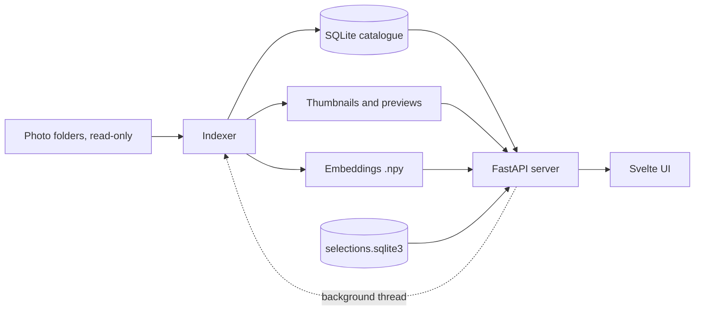

# Riffle: Development Plan

Design notes, measurements, and open work. User-facing documentation is in the README.

Started 25 September 2026 as "Computational Photo Archive"; renamed to Riffle on 26 September 2026.

**Status:** MVP, culling and export, location history, taste model, Curate, and standalone releases are implemented. The search and tag evaluation (§14) is still open.

## 1. Goal

Riffle is for **making a selection** from a large photo library (several thousand photos from trips): find the good ones, pick or reject quickly, and export the picks for editing, sharing, or printing.

It makes the library searchable by image content (CLIP embeddings, zero-shot tags) without training, labelled data, or manual annotation. The first question was whether CLIP search and tagging make an archive noticeably easier to explore. The culling workflow (§8) is built on that.

## 2. Principles

1. **Originals are read-only.** Nothing is renamed, moved, edited, or written next to a source file.
2. **Derived data is disposable.** Thumbnails, embeddings, tags, and positions can be deleted and rebuilt from the originals and the config. The only user-created data (pick/reject flags, export history, your tags) lives separately in `selections.sqlite3` (§6.2).
3. **Local only.** No network calls except downloading model weights once. The map uses bundled outlines, not a tile server.
4. **No data gathering.** Everything comes from a pretrained CLIP model, a hand-written vocabulary, and the user's own flags. The taste model (§9) trains only on those flags, locally.
5. **Few moving parts.** The standard library plus a few well-known packages; no frameworks where plain code does.

Out of scope for now: RAW decoding, captions and OCR, object detection, embedding maps, manual tagging, named collections, star ratings, multi-user or remote access. Several of these are candidates in §15.

## 3. Architecture



- **Indexer** (`index.py`): scan, metadata, thumbnails, embeddings, tags, duplicates, quality and colour measures, stacks, locations. Incremental and restartable. Runs from the CLI (`riffle index`) or in a background thread of the server; both use the same pipeline and report progress through callbacks.
- **Server** (`server.py`, FastAPI): serves the JSON API, thumbnails, previews, and the built UI on one port. It keeps the embedding matrix in memory and reloads it when the files change, so re-indexing needs no restart. The CLIP text encoder loads in a background thread; until it is ready (on the first start that includes the download), browsing works and search reports that the model is loading.
- **UI** (`web/`, Svelte 5 + Tailwind 4, built with Vite, no SvelteKit): a single-page app. `npm run build` writes it into the Python package (`src/riffle/web/`), so every install includes it.
- **Launcher** (`launch.py`): `riffle` without arguments starts the server on 127.0.0.1 (port 8000, or a free port), waits for `/api/health`, and opens the browser. A `server.json` in the cache folder records the running instance; a second launch that finds it answering for the same config only opens a tab.

There is no vector database: search is one matrix–vector product over the in-memory matrix.

### Stopping with the last tab

The one-click launch stops once no tab is open. Each tab keeps a Server-Sent Events stream (`/api/events`); a watchdog stops the server 30 s after the last one closes, or after 5 minutes if none ever connected. It never stops within the first minute, or while indexing or exporting. `riffle serve` never stops by itself.

Why an open connection:

- `beforeunload` can't tell a close from a reload, and misses crashes.
- Timer heartbeats are throttled in background tabs.
- An open connection has neither problem.

With ASGI 2.4, Starlette only notices a closed client when a write fails, so the stream writes a keep-alive every 2 s. The same stream carries the model status (`loading`, `ready`, `failed`) to the page.

One Ctrl+C stops the server cleanly: the event streams end first, so the graceful shutdown doesn't wait for open tabs.

## 4. Technology

| Area | Choice | Notes |
|---|---|---|
| Language | Python 3.12+ | |
| Packaging | `pyproject.toml` + pip | Editable install into a local `venv/` |
| Images | Pillow (+ `pillow-heif` for HEIC) | EXIF, orientation, ICC → sRGB |
| Perceptual hash | `imagehash` (pHash) | Duplicates |
| Embeddings | `open_clip_torch` | Model configurable |
| Maths | NumPy, SciPy | Similarity; the taste model's optimiser |
| Database | `sqlite3` (stdlib) | Plain SQL; schema version in `PRAGMA user_version` |
| Server | FastAPI + Uvicorn | |
| Places | `reverse_geocode` | Offline GeoNames lookup |
| Paths | `platformdirs` | Per-platform config, data, and cache folders |
| Frontend | Svelte 5, Tailwind 4, Vite | d3-geo / d3-zoom and `world-atlas` for the map |
| Tests | pytest, httpx | Synthetic images, fake encoder |
| Releases | PyInstaller, GitHub Actions | §13 |

Deliberately not used: SQLAlchemy, Alembic, FAISS, OpenCV, pyvips, ExifTool, a component library.

## 5. Files and configuration

Per-user files follow platform conventions (`paths.py`; Linux shown, XDG variables honoured; `riffle paths` prints them):

```text
~/.config/riffle/
  config.yaml            # sources, model, thresholds (created from src/riffle/defaults/)
  vocabulary.yaml        # tags and Curate styles
~/.local/share/riffle/
  selections.sqlite3     # flags, export history, your tags: user data (§6.2)
~/.cache/riffle/         # derived, safe to delete (config: data_dir)
  catalogue.sqlite3
  thumbs/                # 320 px long edge
  previews/              # 1600 px long edge
  embeddings/<model_id>.npy, <model_id>.ids.npy, <model_id>.taste.npz
  server.json            # the running instance (one-click launch)
  riffle.log             # standalone builds only
```

macOS uses `~/Library/Application Support/riffle` and `~/Library/Caches/riffle`. Windows uses `%APPDATA%\riffle` (settings and flags, which roam with the profile) and `%LOCALAPPDATA%\riffle\Cache`.

The config is looked up in this order: `--config`, `$RIFFLE_CONFIG`, `./config.yaml`, then the user config (created on first run). In the standalone app, the first-run config defaults to the faster model (§13). `data_dir`, `selections`, and `vocabulary` override the default locations. Relative paths resolve against the config file's folder.

```yaml
sources: [/Volumes/Photos/China]        # written by the UI's Library; comments elsewhere are kept
exclude: ["**/.Trashes/**"]
image_extensions: [.jpg, .jpeg, .png, .tif, .tiff, .heic]
raw_extensions: [.cr2, .cr3, .nef, .arw, .raf, .dng, .orf, .rw2]
raw_search_dirs: [".", "RAW", "../RAW"]  # relative to each image's folder

model:
  name: ViT-L-14-quickgelu
  pretrained: dfn2b
  device: auto          # cuda, mps, or cpu
  batch_size: 32

tags:
  softmax_scale: 100
  subject: { min_prob: 0.15, max_tags: 3 }
  scene:   { min_prob: 0.30, max_tags: 1 }
  look:    { min_prob: 0.30, max_tags: 2 }   # a family without thresholds: 0.2 / 1

dupes:
  phash_max_distance: 8

stacks:
  max_gap_seconds: 30
  min_similarity: 0.92  # model-dependent (§7.7)

location:
  max_gap_minutes: 30
  min_population: 0
location_history: [~/Documents/Timeline.json]
```

The model id is `<name>__<pretrained>`. Each model gets its own embedding file and tags, so models can be compared side by side.

Source layout:

```text
src/riffle/
  cli.py, __main__.py    # riffle [index | tag | serve | paths]
  launch.py              # one-click launch
  frozen.py              # standalone-app setup: log file, error dialogs
  paths.py, config.py    # locations; config loading and the sources rewrite
  db.py                  # catalogue schema and migrations
  scan.py, images.py     # walking, hashing, EXIF; shared image loading
  raws.py, thumbs.py
  embed.py, tags.py      # CLIP; zero-shot tags
  dupes.py               # pHash, and the per-preview measures (sharpness, clipping, colour)
  quality.py, colors.py  # sharpness, clipping, suggested keeper; colour and light
  stacks.py
  timeline.py, locate.py, geotag.py   # location history, placing photos, GPS in exports
  selections.py          # flags and export history
  filters.py             # shared filters and facets
  query.py               # search syntax
  custom_tags.py         # your tags: membership from example photos
  taste.py               # taste model
  curate.py              # Curate
  export.py, jobs.py     # export; background jobs
  server.py
web/src/
  App.svelte
  lib/                   # api.js, state.svelte.js (view state ↔ URL), culling.svelte.js
                         # (flags, undo, selection), connection.svelte.js, justify.js
  components/            # TopBar, ViewBar, Sidebar, Filters, Section, Grid, Detail,
                         # ContextMenu, SelectionBar, Compare, Curate, TagDialog, ExportDialog,
                         # Library, FolderBrowser, Calendar, MapView, Help, UnmatchedRaws
packaging/               # PyInstaller entry point (riffle_app.py) and riffle.spec
.github/workflows/release.yml
```

## 6. Data model

### 6.1 Catalogue

Everything in `catalogue.sqlite3` can be rebuilt from the originals plus the config.

```sql
CREATE TABLE photos (
  id          INTEGER PRIMARY KEY,
  rel_path    TEXT NOT NULL,             -- relative to its source root
  source      TEXT NOT NULL,             -- the configured source folder
  sha256      TEXT NOT NULL,
  size_bytes  INTEGER, mtime REAL,
  width INTEGER, height INTEGER,         -- as displayed (after EXIF orientation)
  taken_at    TEXT,                      -- EXIF DateTimeOriginal, as written
  tz_offset   TEXT,                      -- EXIF OffsetTimeOriginal
  camera TEXT, lens TEXT, lat REAL, lon REAL,
  focal_length REAL, focal_length_35 REAL, aperture REAL, exposure_time REAL, iso INTEGER,
  meta_version INTEGER NOT NULL DEFAULT 0,   -- EXIF extraction version (§7.1)
  phash TEXT, dupe_group INTEGER,        -- dupe_group: lowest photo id in the group
  stack_id INTEGER,                      -- lowest photo id of the stack (§7.7)
  sharpness REAL, clip_highlights REAL, clip_shadows REAL,   -- §7.6
  brightness REAL, contrast REAL, colorfulness REAL, hues BLOB, -- §7.6
  status TEXT NOT NULL DEFAULT 'ok',     -- ok | error | missing
  error TEXT,
  UNIQUE (source, rel_path)
);
CREATE TABLE raws (id, photo_id, rel_path, source, size_bytes);  -- photo_id NULL = unmatched
CREATE TABLE tags (id, family, name);
CREATE TABLE photo_tags (photo_id, tag_id, prob, sim, model_id); -- prob: softmax in family
CREATE TABLE embedded (photo_id, model_id, sha256);              -- what each embedding file holds
CREATE TABLE photo_locations (         -- §7.8
  photo_id INTEGER PRIMARY KEY, lat REAL, lon REAL,
  source TEXT,                         -- exif | visit | route | nearby
  accuracy_m REAL, gap_s REAL, country_code TEXT, country TEXT, region TEXT, place TEXT
);
CREATE TABLE meta (key TEXT PRIMARY KEY, value TEXT);            -- step signatures
```

Schema changes are numbered migrations in `db.py`:

- v2: exposure columns
- v3: `stack_id`, `sharpness`
- v4: locations
- v5: clipping
- v6: colour

`SCHEMA_VERSION` is derived from the list of migrations, so adding one always bumps it. (A missing bump once left existing catalogues without the new columns while fresh ones got them; a test now migrates from every older version and compares the result with a fresh schema.)

Camera GPS stays in `photos.lat/lon`. `photo_locations` holds the result for every placed photo, tagged with its evidence, so camera positions and estimates stay distinguishable.

**Photo identity.** Photos are keyed by `(source, rel_path)`. On rescan:

- same path, same size and mtime → skipped;
- same path, changed content → derived data is recomputed;
- path gone but its hash appears elsewhere → a move, and the id is kept;
- otherwise → `missing`.

Removing a source marks its photos missing. Adding a parent of existing sources keeps their ids through move detection.

### 6.2 Selections (user data)

```sql
CREATE TABLE flags (
  sha256 TEXT PRIMARY KEY,            -- file content, not path or id
  flag TEXT NOT NULL CHECK (flag IN ('pick', 'reject')),
  source TEXT, rel_path TEXT,         -- last known location, for recovery
  updated_at REAL NOT NULL
);
CREATE TABLE exported (               -- v2
  sha256 TEXT PRIMARY KEY, first_at REAL, last_at REAL, times INTEGER,
  last_folder TEXT, source TEXT, rel_path TEXT
);
CREATE TABLE custom_tags (            -- v3: tags taught by example photos (§10)
  id INTEGER PRIMARY KEY, name TEXT UNIQUE COLLATE NOCASE,
  strictness TEXT,                    -- strict | normal | loose
  created_at REAL, updated_at REAL
);
CREATE TABLE custom_tag_examples (tag_id, sha256, source, rel_path, added_at);
```

- **Profiles** (`profiles.py`, selections v4 adds a `profile` name table): each profile is one selections file. The default is the configured file; others are `profiles/<slug>.sqlite3` next to it; the active one is remembered in `active_profile` there (per machine, not in `config.yaml`).
  - The server reads the active file through `sel_path()`.
  - On a switch it clears the custom-tag cache and loads that profile's taste model (`<model_id>.<slug>.taste.npz`; the default keeps `<model_id>.taste.npz`).
  - The SSE status carries the profile, so other tabs reload. The client drops custom tag filters (ids differ per profile) and reloads the page, which resets the flag overlay, undo history, and selection.
  - New profiles start empty or copy chosen tables (flags, exported, custom tags) with `ATTACH` + `INSERT … SELECT`.
  - Switching is refused while indexing or an export runs, and an export records history in the file it started with.
  - Deleted profiles move to `profiles/deleted/`. Curate drafts are keyed per profile.
- Keyed by content hash, so flags survive deleting the cache, re-indexing, moving, and renaming. Exact copies share a flag; editing a file drops it.
- Unflagged photos have no row. Export history is independent of the flag.
- Catalogue connections `ATTACH` this file as `sel`, so filters and listings join flags in SQL (`selections.flag_expr`).
- Flags aren't written as XMP next to the originals (principle 1). XMP in the export folder is a candidate (§15).

## 7. Index pipeline

`riffle index` (or **Index now**) runs every step incrementally. Each step only processes photos that need it, and the CLIP model loads only when something needs embedding or tagging. Measured on the development machine (RTX 3090): 37 large 16-bit PNGs (1.5 GB) indexed in 7–17 s including model load; a no-change run finishes immediately.

### 7.1 Scan

1. Walk the sources, skipping excludes, `._*` files, and the cache folder.
2. Record path, size, mtime, and SHA-256.
3. Read EXIF with Pillow: capture time and offset, make/model, lens, GPS, orientation, focal length (and its 35 mm equivalent), aperture, exposure time, ISO.
4. Record unreadable files as `status = error` and continue.

When extraction gains fields (`META_VERSION`), unchanged files are re-read header-only; nothing else is recomputed. Capture times are stored as written by the camera.

### 7.2 RAW matching

A RAW is linked to the image with the same stem (case-insensitive) in its folder, or in one of `raw_search_dirs`. RAWs are never opened; only name and size are read. Only RAWs inside a configured source are found. Unmatched RAWs are listed separately.

### 7.3 Thumbnails and previews

EXIF orientation applied, converted to 8-bit sRGB (using the embedded ICC profile), saved as a 320 px thumbnail and a 1600 px preview, never upscaled. Runs in a process pool (spawn context; `freeze_support()` for the standalone app).

### 7.4 Embeddings

Previews are embedded in batches, L2-normalised, and written as `<model_id>.npy` with an aligned id array. Incremental runs embed new or changed photos only (tracked in `embedded`) and rewrite both files, which takes well under a second at this size.

### 7.5 Tags

Zero-shot, from `vocabulary.yaml` (§10):

1. Each phrase is encoded with every prompt template, and the results are averaged.
2. A tag scores by its best-matching phrase (max similarity).
3. A softmax over the family's tags (`softmax_scale`) turns scores into probabilities, so a tag's own phrases never compete.
4. Tags with `prob ≥ min_prob` are kept, up to `max_tags`.

`riffle tag` redoes this from stored embeddings in seconds (about 4 s for 1,150 photos).

Known limitations:

- Every photo gets its best tag in each family even when nothing fits well; catch-all tags (`other`, `ordinary daylight`) absorb some of this.
- Overlapping tags split probability, so the vocabulary uses non-overlapping main tags with specific phrases underneath.
- Visible text in a photo pulls tags towards what it says.
- Abstract concepts ("waiting", "tension") work poorly.
- Birds against the sky are sometimes tagged as aircraft.

### 7.6 Duplicates and per-preview measures

One pass over each preview (`dupes.compute_phashes`) computes whatever is missing. Adding a measure doesn't redo the others. It runs in a thread pool (up to 8 threads; decoding and most of the measuring release the GIL): 18.7 s for all 2,132 photos of the first library, 8.8 ms per photo. It used to take about 190 s, 69 % of it in clipping (below).

- **pHash**: all pairs are compared by Hamming distance (NumPy, in chunks), and pairs within `phash_max_distance` are merged into groups (union–find). The grid shows one tile per group. pHash misses reframed bursts; stacks catch them.
- **Sharpness** (`quality.py`): Laplacian variance per 50 px tile of an 800 px greyscale copy; the score is the mean of the sharpest 5 % of tiles.
  - Downsampling first keeps sensor noise from counting as detail.
  - Scoring the in-focus region keeps shallow depth of field from scoring low, which the whole-frame variance did on the first library.
  - Only shown relative to the other photos being compared.
- **Clipping**: the share of pixels with all channels ≥ 250 (blown) or ≤ 5 (crushed).
  - Counting any channel at 255 flagged saturated yellow flowers as a third blown; the all-channel rule scores them 0 % and still catches a blown window (16 %) or white sky (17 %).
  - Flagged in the photo and compare views above 2 % blown (8 % of the first library) or 5 % crushed (3 %; black backgrounds are often intentional).
  - It was a sidebar filter briefly; the API still accepts `exposure=`.
  - Computed with PIL (`ImageChops.darker` / `lighter` over the channels, then a histogram): identical results to NumPy's `min` / `max` over the channel axis, which took 60 ms per preview; now 3.5 ms.
- **Colour and light** (`colors.py`, on a 128 px copy), for Curate (§12):
  - brightness: mean luminance;
  - contrast: RMS;
  - colourfulness: Hasler & Süsstrunk;
  - hues: a 24-bin histogram weighted by chroma, so greys don't count. 12 bins mixed red, orange, and yellow, and put sky blue under teal; 24 separated them.

**Suggested keeper** (`quality.keeper_scores`, `GET /api/suggest`), among the photos being compared:

| Signal | Weight | Scale |
|---|---|---|
| Sharpness | 0.5 | relative to the sharpest |
| CLIP quality | 0.3 | CLIP-IQA prompt pairs "Good photo." / "Bad photo." and "Sharp photo." / "Blurry photo.", relative to the others |
| Exposure | 0.2 | 10 % blown or 25 % crushed scores 0 |

On a 17-shot flower stack, the top two were the ones in focus and the bottom three the soft ones. It is a hint (★, key A), never applied automatically.

### 7.7 Stacks

Photos in capture order are linked to the next when taken at most `max_gap_seconds` apart with CLIP cosine similarity ≥ `min_similarity`. These links are merged with duplicate groups (union–find); every connected set of two or more is a stack.

On the first library (743 bursty wildlife photos; 253 consecutive pairs within 2 s), 30 s / 0.90 with ViT-B-16 gave 141 stacks covering 510 photos. Also requiring similarity to the stack's first photo made no difference, so chaining stays simple.

ViT-L-14 rates consecutive shots as more similar (median 0.955 vs 0.937 within 30 s). There, 0.92 best matches B-16 at 0.90: 91 % agreement on 810 pairs, 251 stacks covering 813 of 1,146 photos (vs 253 / 804). Disagreements were borderline reframings either way.

### 7.8 Locations

Runs after stacks. It is skipped when nothing it depends on changed: a signature covers the history files, the location settings, and every photo's time, offset, and GPS. A full run takes about a second.

1. **Parse** (`timeline.py`): visits, routes, points, and time-zone spans from:
   - the phone Timeline export (Android `semanticSegments` / `rawSignals`; the iOS variant);
   - Takeout `Records.json`;
   - GPX.

   Parsed files are cached by path, size, and mtime. The first user's 43 MB export (2013–2026: 6,262 visits, 6,632 routes, 109,266 points) parses in 0.5 s.
2. **Place** (`locate.py`): camera GPS first. Otherwise the capture time is made absolute with the EXIF offset, or with the timeline's offset for that local time, and then matched:
   - inside a visit → the shortest matching visit (`visit`, ~50 m);
   - inside an activity → interpolated between the nearest points, or the activity's start or end (`route`; accuracy is half the bracket distance, capped at 5 km);
   - otherwise between points within `max_gap_minutes` (`route`), or one point within half of it (`nearby`);
   - else unplaced.
3. **Name** (`reverse_geocode`, bundled GeoNames cities with states, KD-tree): nearest town, region, country. Group keys: `cc`, `cc|region`, `cc|region|place`.

On the first library, every photo had an EXIF offset. 587 of 743 were placed from visits and 156 along routes (mean accuracy ~230 m, at most 9 minutes from the nearest evidence). All were within 1.8 km of one point, so town names suit trips, not a single area (see "spots" in §15).

## 8. Culling and export

- **Flags**: one global pick / reject / unflagged state per photo. Changes show immediately, are saved through `/api/flags`, and can be undone with Ctrl+Z; the API returns the previous flags. With a flag filter active (e.g. Picked + Unflagged, key `H`), rejected photos disappear at once and the selection moves on.
- **Grid**: click, Ctrl-click, Shift-click, drag-select, arrows (Shift extends), and Ctrl+A for the whole listing, not only loaded pages. A floating bar and P / X / U flag the selection. A right-click menu offers the photo view's actions.
- **Loupe**: the photo view; P / X / U flag and advance.
- **Stacks and compare**: **Stacks** collapses each burst into one tile, showing its pick if there is one. The compare view shows a stack, a selection, or (**Review stacks**) every stack in the filters that still has an unflagged photo.
  - Each photo shows its flag, a relative sharpness bar, clipping warnings, and the suggested keeper.
  - 1–9 marks keepers; Enter picks them and rejects the rest.
  - With nothing marked, the first Enter only asks and the second rejects all, so a stray Enter never rejects a burst.
  - Shift+X rejects all, Shift+U unflags all, and Z zooms all photos to 2.5× at the same spot.
- **Export** (`export.py`): copies the picks (all, within the filters, or an exact set from Curate) into a new folder. Files: images, images + RAWs, or RAWs only (optionally falling back to the image). Layout: flat, or the source folders.
  - Copies keep their dates (`copy2`) and are written under a temporary name first.
  - Nothing is overwritten. Identical files are skipped, so a rerun resumes. Other clashes get `-1`, `-2`…, shared by an image and its RAW.
  - Free space is checked first. The destination can't be inside a source. An `export-manifest.csv` lists every file.
  - Runs as a background job. Exported photos are recorded (§6.2) for the ↗ badge, the `exported` filter, and "only photos not exported before".
- **Location in exports** (`geotag.py`, on by default with a location history): photos placed from the timeline get the position in their copies.
  - JPEG and PNG copies get a GPS IFD appended to the EXIF, as a new IFD0 with a GPSInfo pointer plus the GPS IFD at the end. No existing byte moves, so MakerNotes with absolute offsets and the EXIF thumbnail stay valid, and the image data is streamed through unchanged (+340 bytes on the first user's JPEGs). Rebuilding EXIF with Pillow was rejected after it silently dropped the thumbnail (IFD1).
  - If the grown EXIF wouldn't fit a JPEG segment, the position goes into XMP instead.
  - RAW, TIFF, and HEIC copies are never modified; they get a `.xmp` sidecar.

## 9. Taste model

`taste.py`, trained on the user's flags on request (**Library → Your taste → Calibrate**, ~1.1 s including cross-validation).

- **Unit: scenes, not photos.** One sample per stack or single photo (mean embedding). A keeper scene contains a pick or an export; a rejected scene contains only rejects; unreviewed scenes are skipped.
  - Per photo it didn't work: AUC 0.74 against 0.73 for the untrained CLIP quality score. It didn't transfer between libraries, and it was worse than sharpness at choosing a frame within a stack.
  - The cause: about 250 rejects are near-identical siblings of a pick, so the same content is labelled both ways.
- **Model**: balanced L2 logistic regression (L-BFGS, C = 1), with 5-fold cross-validation over scenes.
- **Results** on the first fully flagged library (1,889 photos: 61 picks, 1,828 rejects; 943 scenes, 60 keepers):
  - cross-validated AUC 0.82, against 0.64 for the CLIP quality score and 0.54 for random;
  - the top 20 % of scenes hold 68 % of keeper scenes, the top 30 % hold 77 %;
  - trained on one library, it ranks the other at AUC 0.78 / 0.66;
  - nearest neighbours to the picks reached only 0.68.
- **Offered only** with ≥ 20 keeper scenes, ≥ 50 rejected scenes, and cross-validated AUC ≥ 0.65; otherwise the Library explains why not.
- **Sort order only**: the bottom 30 % still held 3 of the 60 keeper scenes, so "likely rejects" never flags anything.
- **Stacks on by default for these sorts**, since scenes are scored as a whole. In-sample, with Stacks the top fifth of tiles held 55 of 60 picks; without, 38 of 53.
- **Not used for frames within a stack**: that stays with sharpness and the suggested keeper.
- **Storage and training**: saved as `<model_id>.taste.npz` (derived) and loaded at startup (~7 ms); new photos are scored without retraining. An earlier version retrained after every flag change; an explicit button proved more predictable.
- **API**: `GET /api/taste` reports status, the figures, and `changed_since` (flags changed since calibrating; the Library suggests recalibrating from 25).

## 10. Search and vocabulary

Text search encodes the query with the CLIP text encoder and ranks the filtered set by cosine similarity. It never cuts off results. Similar search uses a photo's embedding as the query; the photo and its duplicates are excluded.

**Query syntax** (`query.py`):

- **Exclusion**: `street -people`, `-"parked cars"`. The query vector is the search minus half of each excluded term.
  - Filtering by similarity to the excluded term fails, because CLIP rates "boats" high for any open water: "lake -boats" would lose every lake.
  - Subtraction cleared crowds from "palace -people" and "street -people -cars", and sailboats from "harbour -boats". Weights of 0.8 and above drifted to unrelated photos.
  - With only excluded terms, the photos least like them come first.
- **Alternatives**: `beach | lake -people`. Each alternative is its own phrase and vector, exclusions apply to each, and a photo scores its best match. `-dogs|cats` excludes both.
  - Measured top-30 splits: 11/19 for "ducks | palace", 18/12 for "boats | flowers", 16/14 for "sunset | people -boats", but 30/0 for "sky | statue", because plain-sky photos reach far higher similarities than any statue.
  - Rescaling each alternative against the library (median → 0, 99th percentile → 1) balanced all four. Not adopted: realistic alternatives are of a kind ("cats | dogs"), with comparable similarities, and the plain maximum keeps the score a real CLIP similarity. Revisit if a realistic query shows the imbalance.

**Names** (`query.name_matches`, on by default, `names=false` turns it off; a switch in the search box, remembered per browser): photos whose file name matches the search move to the front, then those whose parent folder does (for a file at a source's root, the source folder), keeping the image order within each group; they carry `name_match: file | folder` for a badge.

- Names are split into words at separators, camelCase, and letter/digit boundaries. Camera prefixes (IMG, DSC, DSCF, PXL, MVIMG, _MG, P…), numbers other than years 1900–2099, and letters wedged between digits (`4cat7`) carry no words.
- A name matches when it holds every word of any alternative (filler words like "at" and "the" ignored; a plural "s" either way) and no excluded term. Whole words keep short searches precise: "cat" matches `cat_01` and `cats-on-roof`, not `catalogue`.
- On the first library, all 1,926 file names are camera names and yield no words; the folders ("Schweden 2026 und so", "Apr 2026") do, so "schweden" puts that trip first. Matching adds 14–20 ms per search.

A text search takes about 10 ms.

**Your tags** (`custom_tags.py`; stored in selections v3, examples by content hash). A photo belongs when its similarity to its best-matching example reaches a fixed level per model: the stack threshold minus 0.05 (strict), 0.08 (normal), or 0.12 (loose). That is 0.87 / 0.84 / 0.80 for ViT-L-14.

- **Best match, not the average**: varied examples each cover their own neighbourhood, and one example equals "find similar". The examples always belong.
- **Tuned on the first library** with tags built from three seagull, fortress, and sheep photos. Members stayed on subject down to about 0.84; below 0.80 they became merely similar scenes (open sky, other waterfront buildings, plain shorelines). Sheep held a plateau of 61–67 photos between 0.85 and 0.75.
- **Rejected: a threshold derived from how alike the examples are.** Near-identical examples (0.96) made it far too strict, and varied examples need no lower bar.
- **Filtering**: members are computed from the in-memory embeddings (cached per tag version and embedding file) and passed to the shared filter as one JSON array per tag (`p.id IN (SELECT value FROM json_each(?))`), so every endpoint honours `ctags=` / `exclude_ctags=`.
- **Speed** on the first library (a three-example gull tag: 44 / 57 / 68 photos at strict / normal / loose): sidebar counts 36 ms, a filtered listing 5 ms, the dialog preview 13 ms.

**Vocabulary** (`vocabulary.yaml`, ~110 tags). Families are top-level keys; an entry is a name, or a name with alternative phrases (the name is always one of them). `styles:` holds Curate's style prompt pairs (§12).

```yaml
templates: ["a photo of {}", "a photograph of {}", "a street photo of {}"]
subject:
  - people: [a person, a man, a woman, people walking, pedestrians, a couple]
  - cats: [a cat, a kitten, a cat sleeping]
  - a temple or pagoda: [a temple, a pagoda, a buddha statue, incense burning, a shrine]
scene:
  - a quiet alley: [a quiet alley, a narrow lane, a hutong, an empty backstreet]
  - other: [an abstract image, a blurry photo, a close-up texture, a plain background]
look:
  - black and white: [a black and white photo, a monochrome photograph]
  - ordinary daylight: [an ordinary daytime photo, a photo in plain daylight]
styles:
  moody: {label: Moody, towards: [...], away: [...]}
```

## 11. Server and UI

### 11.1 API

| Method | Path | Purpose |
|---|---|---|
| GET | `/api/photos?<filters>&collapse=&sort=&group=&offset=&limit=` | Grid listing. `collapse`: `dupes`, `stacks`, `none`. `sort`: `taken_at`, `-taken_at`, `name`, `-name`, `place`, `-place`, `taste`, `-taste`. With `group`, items carry their group key and `groups` lists all groups (§11.2) |
| GET | `/api/groups?group=&<filters>` | Groups only, with count, date span, cover, label, and centre (calendar, map) |
| GET | `/api/photos/{id}` | Detail: metadata, tags, RAWs, duplicates, stack, location, flag |
| GET | `/api/search/text?q=&names=&<filters>` | Text search (§10); `names=false` turns off file/folder name matching |
| GET | `/api/search/similar/{id}?<filters>` | Similar photos |
| GET | `/api/tags?<filters>` | Tags by family with counts within the filters; your tags (`custom`, with examples and counts); totals |
| POST | `/api/custom-tags`, `/api/custom-tags/{id}`; DELETE `/api/custom-tags/{id}` | Create a tag from example photos; edit (name, strictness, add/remove examples); delete |
| POST | `/api/custom-tags/preview` | Member counts per strictness and the edge photos, for the tag dialog |
| GET | `/api/facets?<filters>` | Filter options with counts; each facet ignores its own filter |
| GET | `/api/ids?<filters>` | Every id of the listing (select all) |
| POST | `/api/flags` `{ops}` | Set flags atomically; returns previous flags (undo) |
| POST | `/api/flags/reset?<filters>` `{scope}` | Unflag all or within the filters |
| GET | `/api/stacks?<filters>&unreviewed=`, `/api/stacks/{id}` | Stacks; one stack's photos |
| GET | `/api/suggest?ids=` | Suggested keeper with its scores |
| GET / POST | `/api/export` | Export status / start (picks, filtered picks, or `photo_ids`) |
| POST | `/api/exported/reset?<filters>` `{scope}` | Forget export history |
| GET / POST | `/api/taste`, `/api/taste/calibrate` | Taste model status / calibrate |
| GET, POST, DELETE | `/api/profiles`, `/api/profiles/{slug}`, `/api/profiles/{slug}/activate` | List (with counts), create (empty or copying parts), rename, delete, switch |
| GET | `/api/styles`, `/api/hues` | Curate's styles and colour swatches |
| POST | `/api/curate?<filters>`, `/api/curate/alternatives?<filters>` | Curate draft; alternatives for one slot (§12) |
| GET, POST, DELETE | `/api/sources` | Photo folders (written to `config.yaml`); changes start indexing |
| GET, POST, DELETE | `/api/location-history` | History files and placement counts |
| GET | `/api/fs?path=&files=` | Server-side folder browser |
| GET / POST | `/api/index` | Indexing status / start (a request during a run queues one more) |
| GET | `/api/raws/unmatched` | Unmatched RAWs |
| GET | `/api/health` | Identity, version, config, model status (launcher) |
| GET | `/api/events` | One SSE stream per tab (§3) |
| GET | `/thumbs/{id}.jpg`, `/previews/{id}.jpg`, `/` | Images; the built UI |

`<filters>` (`filters.py`) are shared by all endpoints:

- `tags=1,2` (AND), `exclude_tags=3,4`;
- `date_from`, `date_to` (`YYYY-MM-DD`);
- repeated `camera=`, `lens=` (OR; empty = unknown);
- `focal_min/max`, `aperture_min/max`, `iso_min/max`;
- repeated `orientation=`, `flag=` (`pick`, `reject`, `none`), `exposure=`;
- `gps=`, `exported=`;
- repeated `country=`, `region=`, `place=`, `loc_source=`;
- repeated `folder=`: a photo's direct parent folder, without subfolders;
- `ctags=1,2` (your tags, AND), `exclude_ctags=`.

Different filters combine with AND.

Mutating endpoints accept only JSON bodies, so other sites can't trigger them without a CORS preflight, which the server doesn't grant. The server binds to 127.0.0.1 because the folder browser can list anything it can read.

### 11.2 UI

A single page without a router. View state lives in a Svelte store mirrored into the URL (search, tags, filters, grouping, sort, open photo), so views can be bookmarked.

- **Top bar**: search; a "similar to" chip; the workflow (**Review stacks**, **Curate**, **Export**); then **Library** (with indexing progress) and **?** (help).
- **Toolbar above the grid**: result count; **Group** with a **Grid | Calendar/Map** switch; **Sort**; **Stacks**.
  - A grouping keeps groups together, so it allows the date sorts, plus the place sorts for location groups and the file-name sorts for folders. Those order the groups by name, and the photos within them by the same sort.
- **Sidebar**: "N active · Clear all" when anything narrows the view; then collapsible filter sections (Flag, Folder, Date, Camera, Lens, Exposure, Orientation, Location, Places) and tag families. Subject, Scene, and Look start open; each section remembers its state.
  - Options show counts within the other filters.
  - A filter that can't narrow the result is hidden unless in use.
  - The Folder section lists direct parent folders, labelled like the folder groups: the first 15, then "All N folders".
  - Tags include on click and exclude on Alt+click or hover-**−**.
- **Grid**: infinite scroll, badges (✓, ✕, ↗, RAW, duplicates, ▦ stack count), and multi-select (§8). When grouped: sticky headers with full counts, **Jump to…**, and "Only this day / folder".
  - Groups appear in date order, or trip order for places (by each group's first photo), or path order for folders.
- **Overviews**: a year calendar (days with a cover and count), or a map with one cluster per place, region, or country. Clicking opens the group in the grid. The map draws bundled Natural Earth outlines (`world-atlas` 50m, loaded lazily) with d3-geo and d3-zoom; street-level detail was left out deliberately.
- **Photo view**: preview, metadata, tags, location with source and accuracy, taste score, and flag buttons. Actions: Stack, Find similar, Show day, Show place, Copy path.
- **Library**: photo folders, folder browser, **Index now** with progress, location history, profiles, taste model, and flag / export-history resets.
- **Profiles**: a switcher in the top bar once there are two or more, and "Profile: <name>" at the top of the sidebar outside the default profile.
- **Help**: the workflow in steps and all shortcuts.

Tailwind only; no component library.

## 12. Curate

`curate.py`, `Curate.svelte`. It drafts a small selection (photo book, exhibition) from the current filters: high quality, but varied in content, time, and place.

**Candidates.** Picks and unflagged photos within the filters; a switch adds rejects, and a locked reject always stays. Each stack or duplicate group contributes one representative: the locked photo, else the pick, else the best frame (CLIP quality, exposure, sharpness).

**Quality `q`.** Rank percentiles within the candidates, weighted:

| Signal | Weight |
|---|---|
| Taste | 0.45 (when calibrated; otherwise its weight moves to CLIP quality) |
| CLIP quality | 0.25 |
| Exposure | 0.10 |
| Pick | bonus +0.15 |
| Exported before | bonus +0.05 |

Then:

- **Styles** (CLIP prompt pairs in `vocabulary.yaml`; score = embedding · (mean towards − mean away)) add `0.6 · mean(wₖ · (2·pctₖ − 1))` over the active sliders.
  - Each style was checked with top/bottom-12 contact sheets on the first library and separates visibly.
  - "Breathtaking" became Scenic. "Artistic" turned out to be what CLIP reads as abstract close-ups, so it is labelled Abstract & details.
- **Colour and light** choices (§7.6) enter the same term at weight 1, using `curate.look_scores`. Hue affinity is the chroma-weighted share within ±30° of the swatch, with a triangular window. Photos not yet analysed get the median.
  - Checked with top-40 contact sheets per measure. "Soft" mostly finds empty skies, which the quality term keeps in check.
- **A search** (the §10 syntax) adds its own term, `1.0 · (2 · pct − 1)`. It isn't averaged with the styles, so it stays strong beside them, and it scores rather than filters.
  - On the Sweden trip with rejects (474 candidates): "boats" gave boats and harbours from different spots, "people -boats" gave people without boats, and "palace | church" gave palaces, churches, and towers.

**Selection.** Greedy maximal marginal relevance: each step adds the candidate maximising `(1 − v)·q − v·max redundancy`, where `v` is Best ↔ Most varied. Redundancy to a chosen photo is the weighted mean of:

- **content**: CLIP cosine, rescaled so 0.5 → 0 and 0.95 → 1;
- **time closeness**: `exp(−|Δt| / 3 h)` × time spread;
- **place closeness**: `exp(−d / 300 m)` × place spread × position reliability (1 for EXIF and visits; route estimates by `accuracy_m`).

Locked photos are taken first and removed ones are excluded. The result is deterministic. The original design had day/place coverage quotas; the time and place terms already covered every day of the first trip, so they weren't needed.

Place names are too coarse for place variety (a whole trip can fall into one town); coordinates separate the harbour from the old town.

**View.** The draft is shown as one justified block in capture order (`lib/justify.js`):

- Rows of equal height fill the width.
- Row breaks are chosen for the whole draft by dynamic programming, keeping heights within 60–160 % of a target of about a quarter of the width. The last row also fills unless that would make it too tall.
- It uses previews, not the 320 px thumbnails.
- On the Sweden drafts, rows ranged from 255 to 378 px.

Per photo: the reason (e.g. "your pick · best of 14 similar shots · very moody"), Lock, Alternatives (the stack's other frames first, then `0.5 · redundancy + 0.5 · q`), and Remove (for this draft only; not a reject).

**Mark as picks** is the only action that changes flags, and it can be undone. **Export** sends exactly the draft (`photo_ids`). The draft (settings, search, locks, removals) is stored in `localStorage` per filter set. The API still returns `cover` and `sections`, which the view no longer uses.

**Measured** on the first library (1,926 photos, 61 picks, taste calibrated):

- 40–300 ms per draft; the first request with a style encodes its prompts.
- Sweden trip with defaults: 30 candidates; 12 photos over all 3 days and 5 places (7 places at variety 0.8).
- With rejects (474 candidates) and Moody +1: an alley, the underground, and a crow at a café table came in, and 10 picks were kept.

## 13. Standalone releases

PyInstaller folder builds without a console window, zipped. A single-file build would unpack PyTorch on every start, so it was ruled out.

**Targets:**

- Linux x64, built on Ubuntu 22.04 for an older glibc;
- Windows x64;
- macOS arm64 (PyTorch has no Intel macOS wheels any more).

Linux and Windows use CPU-only PyTorch, since CUDA wheels would exceed GitHub's 2 GB asset limit. A Vulkan backend isn't practical (PyTorch's was mobile-only and is deprecated). ONNX Runtime with DirectML or CoreML would be the route to GPU support and much smaller builds (§15).

**CPU defaults:** a first start in the app writes the faster model into the new config (`paths.standalone_defaults`: ViT-B-16 / DFN-2B, `stacks.min_similarity` 0.90). On the same CPU that gives 11.5 photos/s instead of 2.7, and a 571 MB download instead of 1.6 GB. The pip install keeps ViT-L.

**In the app** (`frozen.py`, `packaging/riffle_app.py`):

- Output goes to `riffle.log` (previous run: `.log.1`).
- Fatal errors show a native message box.
- On Linux the browser starts without PyInstaller's `LD_LIBRARY_PATH`.
- The model loads in the background (§3), and the page shows a banner while it downloads or if it fails.
- torchvision ≥ 0.29's `_C_stable` operators are collected by hand, because the PyInstaller hook misses them.

**CI** (`.github/workflows/release.yml`):

1. Build the UI.
2. Install and run the tests.
3. Build.
4. Smoke-test each executable offline (`HF_HUB_OFFLINE=1`): `/api/health`, the UI, and `model: failed` without crashing.
5. Package (`tar.gz` keeps the executable bit).

A `v*` tag matching the `pyproject.toml` version publishes a release; a manual run only builds. v0.1.0 artifacts: Windows 208 MB, macOS 201 MB, Linux 311 MB.

**Measured locally** (Linux, Python 3.14, torch 2.14 CPU): a 67 s build, 920 MB unpacked; the server answers in 0.5 s, and the model is ready 25 s later on a first start including its download.

**Open:** signing and notarisation (paid certificates), an icon, publishing to PyPI.

## 14. Evaluation (open)

A short qualitative note:

- 20 text queries: how many of the top 20 results are relevant?
- 10 similar searches: useful, or just near-copies?
- Tags: 30 photos each for the 10 largest tags; which are reliable?
- Timing: full index and search latency.
- Is a multilingual CLIP model worth adding for Chinese queries and signage?

### 14.1 Experiment: penultimate-layer features for similarity (27 Sep 2026)

Question: would image features from deeper inside CLIP serve "find similar" and your tags (§10) better than the final, text-aligned embedding? Compared on the first library (2,132 photos, ViT-L-14 DFN-2B, previews), each variant also mean-centred:

- **final**: the current embedding (projected into the joint image–text space);
- **pre-proj**: the pooled image features before that projection;
- **pen CLS**: the class token after the second-to-last transformer block;
- **pen mean**: the mean of that block's patch tokens.

**Near-duplicates.** Photos within 5 s (or 30 s) of each other count as the same subject. Scored by R-precision: the share of each photo's nearest neighbours, as many as it has burst partners, that are those partners.

| | 5 s | 30 s |
|---|---|---|
| final | 0.758 | 0.680 |
| pre-proj | 0.759 | 0.683 |
| pen CLS (centred) | 0.740 (0.747) | 0.672 |
| pen mean | 0.753 | 0.676 |

**Concepts.** Four concepts labelled by eye: sheep, gulls, the Vaxholm fortress, candles; about 20–50 matching photos each. Only the union of every variant's top 40 was labelled; everything else counts as non-matching. Scored by average precision:

| | Your tags (3 examples) | Find similar (1 example) |
|---|---|---|
| final | 0.966 | 0.940 |
| final, centred | 0.979 | 0.946 |
| pre-proj, centred | 0.979 | 0.947 |
| pen CLS | 0.976 | 0.937 |
| pen CLS, centred | 0.985 | 0.947 |
| pen mean | 0.935 | 0.870 |

**Result.** No clear win for the penultimate layer:

- Its best form (class token, centred) leads on tags by 0.006. Most of that comes from one concept, which is within the noise of four fairly easy concepts.
- It is slightly worse on near-duplicates.
- Averaging patch tokens is clearly worse.

Most of the small gain comes from mean-centring (subtracting the library's average embedding), which costs nothing on the current embedding. But it shifts all similarities, so the tag and stack thresholds would need retuning.

Not adopted: it would mean re-embedding every photo and keeping a second matrix, since text search still needs the final one.

**Open:** more nuanced concepts could favour deeper features, which this benchmark could not test: one particular person, pet, or character among others of its kind. That needs a labelled set with such identities. See §15.

## 15. Candidates

Roughly in order of value:

1. Named collections ("Print", "Photo book") next to the global pick/reject, each with its own export; saving a Curate draft as one. Optionally star ratings.
2. Manual tag add/remove, stored with the flags.
3. Finer location "spots" within a town: clustered visit positions (~200 m), labelled with the town, and "Home" / "Work" where the timeline marks them.
4. Comparing models on the §14 queries: SigLIP SO400M, or a multilingual model. SigLIP needs `softmax_scale` and the stack threshold retuned.
5. Per-camera clock correction. Location matching depends on it: a camera 10 minutes off places photos along the wrong stretch of a route.
6. Curate styles and colour measures as grid sorts or filters.
7. "More like my picks" search (the taste model's weight vector as a query).
8. ONNX Runtime inference: smaller releases, and GPU support via DirectML (Windows) and CoreML (macOS).
9. Deeper image features (the penultimate CLIP layer, mean-centred) for find similar and your tags. They weren't better on everyday concepts (§14.1), but could be for individuals or characters, where the text-aligned embedding may blur one member of a kind into the others. Test first on a labelled set of such identities, then weigh it against the cost of a second embedding.
10. People and pets: detect and group individuals (faces with a dedicated recognition model; pets via animal detection and crop embeddings). See §15.1.
11. Mean-centring the current embedding for find similar and your tags: a small, free gain in §14.1, with the thresholds retuned.
12. An embedding map (UMAP) for exploration.
13. Captions and OCR through a local vision-language model.
14. Flags as XMP sidecars in the export folder, for Lightroom and darktable.

### 15.1 People and pets (design notes, not started)

Grouping photos by individual (a person, a pet) is beyond CLIP. It is trained to match whole images to captions, so it encodes "a man with glasses on a street", not which man: two people in similar settings come out closer than one person in two settings. Identity needs models trained for it, applied to crops.

**People: face detection and face recognition** (the approach of Immich, digiKam, and PhotoPrism).

1. Detect faces in each preview (boxes and landmarks); skip tiny or blurred ones.
2. Embed each face with a recognition model, which maps the same person to nearby vectors across age, lighting, and angle.
3. Cluster the face vectors into likely individuals.
4. The user names clusters, merges them, and marks "not this person". New photos are assigned to named people, and uncertain matches are offered for confirmation.

Model licences matter, because the release builds ship the models:

| Option | Notes |
|---|---|
| InsightFace (e.g. `buffalo_l`, used by Immich) | Best accuracy; weights are non-commercial / research only, so not for the releases |
| OpenCV YuNet (detector) + SFace (recogniser) | Good accuracy, small ONNX models, fast on CPU; Apache 2.0. The preferred start, run through ONNX Runtime or OpenCV DNN |
| dlib / `face_recognition` | Permissive but older; weaker on non-frontal faces; heavy dependency |

**Pets: experimental.** There is no animal counterpart to face recognition. The practical route:

1. Detect animals with a general object detector (COCO classes: cats, dogs, horses…). Use a permissively licensed one, such as torchvision's detectors or the DETR family; Ultralytics YOLO is AGPL.
2. Embed each crop with a self-supervised model such as DINOv2 (Apache 2.0), which keeps fine detail like fur pattern and markings better than CLIP. This is the "individuals" case of §14.1.
3. Teach an individual by example through the your-tags mechanism (§10), using crop embeddings, instead of clustering automatically.

Distinctive animals should work; look-alikes (two black labradors) will be confused.

**Fitting it in:**

- **Index:** an optional step (people first, pets later). Face and animal boxes and vectors are derived data.
- **User data:** names, merges, and confirmations go in `selections.sqlite3`, keyed by photo content hash and box, so they survive re-indexing.
- **UI:**
  - a People section in the sidebar that filters like tags, with AND for "photos with both";
  - a page of unnamed clusters to name, merge, or split;
  - face chips in the photo view;
  - optionally, a Curate term that spreads a draft over people.
- **Privacy:** face vectors are biometric data. Everything stays local, the step is opt-in in the Library, and a "forget all face data" action deletes the vectors and names.
- **Cost:** roughly 10–30 ms per photo on a CPU for detection and embedding (a couple of minutes per 2,000 photos), far less on a GPU. Adds ONNX Runtime (or OpenCV), which §4 currently avoids.

**First step when picked up:** a feasibility check on the first library. How many usable faces are there (size, angle), and do the clusters make sense? That shows whether trip photos contain enough repeat individuals to be worth it.

Location-history questions still open: how accurate is the history on photos that also have GPS (the first library has none), and how to handle several phones, or a missing phone for part of a trip.

## 16. Decisions

1. Development machine: Linux with an NVIDIA RTX 3090 (CUDA).
2. Formats: JPEG, PNG, and TIFF (test data includes large 16-bit PNGs). HEIC is an optional extra (`.[heic]`).
3. RAW search dirs default to `.`, `RAW`, and `../RAW`, relative to each image's folder.
4. Default model: `ViT-L-14-quickgelu` / `dfn2b` since 26 Sep 2026 (about 81 % ImageNet zero-shot), replacing `ViT-B-16` / `laion2b_s34b_b88k` (70 %). Alternatives: `ViT-B-16` / `dfn2b` (76 %, the standalone default) and `ViT-H-14-quickgelu` / `dfn5b` (83 %). The 1,146-photo library embeds in under a minute on the RTX 3090.
5. Flags: one global pick/reject per photo, in a separate database keyed by content hash.
6. Location history: referenced in place (not copied), placed at place / region / country level, with route-interpolated positions used but marked.
7. Taste model: calibrated on request, not retrained in the background.
8. Standalone builds: zipped folders, not single files; CPU inference with the faster model.
